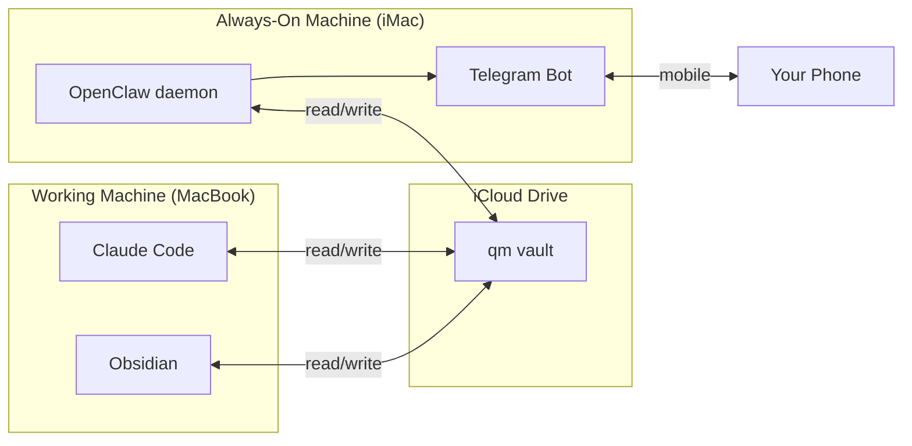

# Always-On Daemon

!!! abstract "TL;DR"
    A Telegram bot runs 24/7 on a second machine, connected to the same vault via iCloud sync. Hourly heartbeat processes your inbox, flags stale waiting items, sends a morning plan to your phone, and handles mobile task capture. The system has agency between sessions.

## What

QM's always-on layer is a Telegram bot called OpenClaw that runs on a separate, always-powered machine. It connects to the same vault via iCloud sync and runs an hourly heartbeat cycle that handles five things: inbox processing, waiting item alerts, due-today reminders, a morning plan, and an evening summary.

This is what makes QM different from a chatbot you open when you remember to. The system works while you sleep.

## Why

Claude Code runs on your laptop. Your laptop sleeps, travels, and closes. That creates gaps: a transcript dropped in the inbox at 4pm sits unprocessed until your next session. A waiting item hits 14 days and nobody notices. You wake up and spend the first 20 minutes figuring out what matters today.

A daemon on a second machine eliminates the gaps. Inbox files get processed within the hour. Waiting items trigger alerts before they go stale. Your morning plan arrives on your phone before you open your laptop.

## How

### Two-Machine Architecture

Both machines sync through iCloud Drive. Files modified on either machine appear on both within seconds. The daemon reads and writes the same vault that Claude Code and Obsidian use. No API, no database, no sync layer to build. iCloud handles it.

### The Heartbeat Cycle

Every hour, the daemon runs five checks:

| Check | When | What it does |
|-------|------|-------------|
| **Inbox processing** | Every run | Scans `00_Inbox/` for new files. Small files get auto-processed: decisions, actions, and insights extracted, routed to the right theme folder, action items appended to `tasks.md`. Large files (>5,000 words) get flagged to Telegram for manual `/transform`. |
| **Waiting items** | Daily, morning | Scans `tasks.md` for `@waiting(Name)` items. Flags anything older than 7 days. Sends a Telegram summary with person, item, and age. |
| **Due today** | Daily, morning | Lists unchecked tasks with today's date. Sends to Telegram. |
| **Morning plan** | Once, 6-8am | Reads all tasks and theme status files. Calculates priorities (P1: due today + high leverage, P2: stale waiting items, P3: this week, P4: rest). Writes full plan to `daily-plan.md`, sends condensed version to Telegram. |
| **Evening summary** | Once, 5-7pm | Compares completed vs planned tasks. Counts pending captures and stale waiting items. Sends a scorecard to Telegram. Skips weekends unless overdue P1s exist. |

### Telegram Commands

The bot also responds to direct messages:

| Message | Response |
|---------|----------|
| "priorities?" or "what next?" | Top 3-5 tasks from today's plan |
| "status [theme]" | Current Now section + blockers from that theme's `status.md` |
| "waiting?" | Full waiting list with ages, flags items >7 days |
| "[Person] agenda?" | Aggregates `@agenda(Person)` + `@waiting(Person)` items |
| Free text with `#theme` tag | Captured as a task in `tasks.md` with the right theme |

The bot keeps responses short (Telegram-sized). Deep analysis, document writing, and transcript processing hand off to Claude Code.

### What Gets Processed Automatically

When a file lands in `00_Inbox/`:

1. The heartbeat detects it (checked against a manifest of already-processed files)
2. Files under 5,000 words get auto-processed:
    - Theme inferred from people and keywords
    - Raw transcript archived to `02_Themes/[theme]/processed/`
    - Structured summary created in `02_Themes/[theme]/meetings/`
    - Action items extracted and appended to `tasks.md`
    - Telegram notification: what was processed, how many actions found
3. Files over 5,000 words get flagged to Telegram for manual processing

### Design Decisions

**Why a second machine, not a cloud server?** iCloud sync gives you vault access for free. No deployment pipeline, no cloud costs, no security concerns about your vault living on a server. Any always-on Mac works: an old iMac, a Mac Mini, whatever doesn't sleep.

**Why Telegram?** It's on your phone, supports bot APIs natively, and messages are instant. No app to build. The bot is a standard Telegram bot created via BotFather.

**Why hourly, not real-time?** Rate limits (API token budgets) and diminishing returns. Most inbox items can wait an hour. The morning plan only needs to run once. Hourly is conservative and cheap.

**Why Sonnet, not Opus?** The daemon handles capture and lookup, not strategic analysis. Sonnet is 5-10x cheaper and overqualified for these tasks. Opus is reserved for Claude Code sessions where deep reasoning matters.

## Building Your Own

The template doesn't include a pre-built daemon (too many variables: which machine, which bot platform, which sync method). But the pattern is straightforward:

1. **Pick a bot platform.** Telegram (recommended), Discord, Slack, or anything with a message API.
2. **Pick an always-on machine.** Old Mac, Raspberry Pi, cloud VM, whatever stays powered.
3. **Sync the vault.** iCloud, Dropbox, Syncthing, or rsync. The daemon needs read/write access to the same files Claude Code uses.
4. **Write heartbeat checks.** Each check is a script that reads vault files, applies logic, and sends a message. Start with inbox processing and waiting item alerts.
5. **Schedule the heartbeat.** Cron, launchd, systemd, or a built-in scheduler. Hourly is a good starting interval.

The vault's plain-markdown structure makes this easy. Tasks are text lines with known patterns (`@waiting`, `📅`, `!impact`). Inbox files are markdown or text. No database queries, no API calls to your own system. Just file reads and string matching.

## Key Insight

The daemon turns QM from a tool you use into a system that works for you. The psychological shift matters: knowing that your inbox gets processed, your waiting items get flagged, and your morning plan arrives automatically changes how you think about your workday. You stop worrying about what you might have missed.

## Customisation Points

- **Adjust heartbeat frequency** based on your inbox volume and API budget
- **Add checks** for calendar events, build status, weather, or anything with a parseable source
- **Change the bot platform** to Discord or Slack if that's where you live
- **Run on a cloud VM** if you don't have a spare Mac (just sync the vault)
- **Add voice input** via Telegram voice messages + a transcription service

## Related

- [System Overview](overview.md) - Where the daemon fits in the six-layer architecture
- [Three-Hook Automation](hooks.md) - Claude Code hooks handle in-session automation; the daemon handles between-session automation
- [Skills System](skills-system.md) - The daemon hands off complex processing to skills like `/transform`
- [Folder Structure](folder-structure.md) - The daemon reads and writes the same numbered folders
