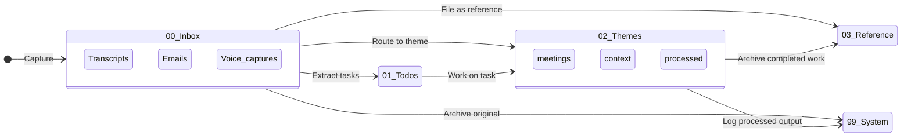

# Folder Structure

!!! abstract "TL;DR"
    Five numbered folders (`00` through `99`) mirror the workflow: capture, process, work, reference, system. Each theme gets a subfolder with its own `claude.md` for context-specific AI behaviour. Moving a file between folders *is* the processing step.

## What

QM organises all content in a numbered-prefix folder hierarchy. Five top-level folders, each prefixed with a two-digit number. The prefix determines sort order, and sort order matches workflow order: capture (00) to process (01) to work (02) to reference (03) to system (99).

## Why

Numbered prefixes solve two problems at once. First, they force consistent ordering across every file browser, terminal listing, and Obsidian sidebar. Second, they signal workflow stage. When you see a file in `00_Inbox/`, you know it hasn't been processed. When it's in `02_Themes/`, it has a home. No ambiguity.

## How

### File Lifecycle

Content flows through folders as it moves from raw capture to permanent reference:



Moving a file between folders *is* the processing step. The numbered prefixes encode workflow stage.

### Top-Level Folders

| Folder | Purpose | Update Cadence |
|---|---|---|
| `00_Inbox/` | Landing zone. Unprocessed transcripts, emails, captures. | Multiple times daily |
| `01_Todos/` | Task management. Single source of truth (`tasks.md`) plus AI-generated views. | Daily |
| `02_Themes/` | Active work themes. One subfolder per theme (project-a, project-b, etc.). | Per session |
| `03_Reference/` | Static reference materials. Templates, guides, policies. | Rarely |
| `99_System/` | System files. Search indexes, logs, processed archives. | Automated |

### Theme Structure

Each theme folder follows a standard layout:

```
02_Themes/[theme-name]/
    claude.md           # Theme-specific instructions for Claude
    status.md           # Now / Next / Blockers / Decisions
    meetings/           # Meeting notes (YYYY-MM-DD_topic.md)
    context/            # Strategic context docs, frameworks
    processed/          # Synthesised outputs from transcripts
    emails/             # Email drafts and threads
```

The `claude.md` file is critical. When Claude Code works within a theme, it reads this file for theme-specific rules, terminology, and constraints. This is how a single AI assistant behaves differently when working on a PE deal versus a construction project.

### The .claude/ Directory

Claude Code's own configuration lives at the vault root:

```
.claude/
    skills/             # SKILL.md files (one per skill)
    hooks/              # Shell scripts (session-start, session-stop, post-write)
    rules/              # Additional rule files
    settings.json       # Hook wiring, permissions
```

### Memory Directory

Memory files live in Claude Code's project-scoped auto-memory directory, outside the vault itself. This keeps persistent memory separate from working content. See [Memory System](memory-system.md) for details.

## Key Insight

The folder structure is the workflow. Moving a file from `00_Inbox/` to `02_Themes/project-a/processed/` isn't just filing - it's processing. The structure enforces discipline without requiring discipline.

## Customisation Points

- **Add themes** by creating a subfolder in `02_Themes/` with at least a `claude.md`
- **Add inbox sources** by creating subfolders in `00_Inbox/` (e.g., `macwhisper/`, `email-exports/`)
- **Adjust theme structure** to fit your domain - the subfolders are conventions, not hard requirements
- **Rename prefixes** if you prefer different ordering, but keep the numbered-prefix pattern

## Related

- [System Overview](overview.md) - How folders fit into the seven-layer architecture
- [Skills System](skills-system.md) - Skills read from these folders during execution
- [Three-Hook Automation](hooks.md) - The stop hook auto-commits changes across these directories
