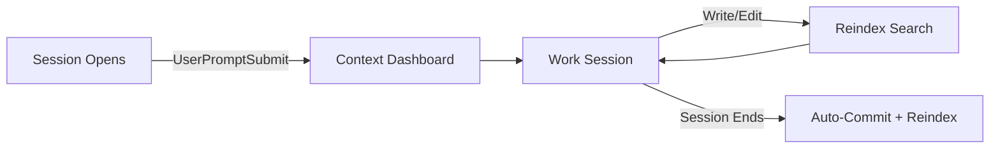

# Three-Hook Automation

!!! abstract "TL;DR"
    Three hooks fire automatically: **session-start** loads a context dashboard, **session-stop** commits all changes to git, **post-write** reindexes search. Zero manual maintenance. Every session starts informed and ends saved.

## What

QM uses three hooks that fire at specific points in the Claude Code lifecycle. They automate context loading, change persistence, and search freshness - the three things you'd otherwise forget to do manually.

## Why

Without hooks, every session starts cold. You'd need to manually load context, remember to commit changes, and reindex search after edits. Hooks eliminate this friction entirely. Three hooks is the right number: one for each lifecycle boundary (start, stop, write). More would add overhead without proportional value.

## How

### Hook 1: UserPromptSubmit (Context Load)

Fires on the first user message of a conversation. The shell script:

- Prints the current date and vault structure
- Lists active themes sorted by recent modification
- Shows tasks due today or overdue (parsed from `tasks.md`)
- Surfaces high-leverage tasks (`!impact(H)` + `!effort(L)`)
- Counts waiting items and inbox files
- Refreshes BM25 search index in the background

This gives Claude Code immediate situational awareness. No "what are we working on?" - it already knows.

### Hook 2: Stop (Auto-Commit)

Fires when a conversation ends. The shell script:

- Checks for uncommitted changes in content directories
- Stages files from `00_Inbox/`, `01_Todos/`, `02_Themes/`, `03_Reference/`
- Stages skill, hook, and rule changes from `.claude/`
- Builds a commit message with file count and affected themes
- Commits with a standardised format: `Session checkpoint: project-a, project-b (4 files, 2026-02-27)`
- Triggers search reindexing in background

No work is ever lost. Every session's changes are captured automatically.

### Hook 3: PostToolUse (Reindex)

Fires after every Write or Edit tool use. Runs asynchronously (doesn't block Claude). Refreshes the BM25 keyword search index so newly created or modified files are immediately searchable within the same session.

### Wiring in settings.json

Hooks are configured in `.claude/settings.json`:

```json
{
  "hooks": {
    "PostToolUse": [
      {
        "matcher": "Write|Edit",
        "hooks": [
          {
            "type": "command",
            "command": "bash .claude/hooks/post-write-reindex.sh"
          }
        ]
      }
    ],
    "UserPromptSubmit": [
      {
        "hooks": [
          {
            "type": "command",
            "command": "bash .claude/hooks/session-start.sh"
          }
        ]
      }
    ],
    "Stop": [
      {
        "hooks": [
          {
            "type": "command",
            "command": "bash .claude/hooks/session-stop.sh"
          }
        ]
      }
    ]
  }
}
```

The `matcher` field on PostToolUse ensures reindexing only triggers on file modifications, not on every tool call. Hook arrays use the `"hooks"` key to contain one or more command objects.

### Hook Lifecycle



## Key Insight

Hooks handle the boring but critical maintenance work. The session-start hook alone saves 2-3 minutes per conversation. Over dozens of daily sessions, that compounds into hours of recovered focus time.

## Customisation Points

- **Add dashboard sections** to session-start (e.g., calendar events, weather, build status)
- **Exclude directories** from auto-commit by adjusting the `git add` paths
- **Add post-write triggers** beyond reindexing (e.g., linting, validation)
- **Adjust timeouts** - the stop hook has a 30-second cap to prevent hanging

## Related

- [System Overview](overview.md) - Where hooks sit in the six-layer architecture
- [Folder Structure](folder-structure.md) - The stop hook commits across vault directories
- [Three-Mode Search](search.md) - The post-write hook triggers search reindexing
- [Skills System](skills-system.md) - The session-start hook surfaces context that skills build on
