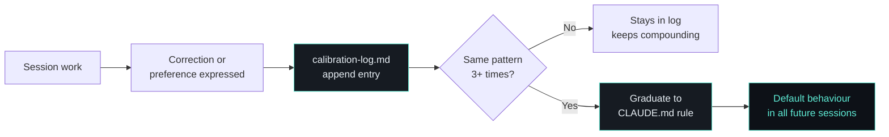

# Six-File Memory System

!!! abstract "TL;DR"
    Six markdown files survive between sessions: strategic state, voice samples, rejection patterns, cross-theme connections, stakeholder postures, and recent decisions. Rejection patterns that appear 3+ times graduate to permanent rules. The system literally rewrites its own instructions.

## What

Six markdown files that persist across Claude Code conversations. They live in Claude Code's auto-memory directory and are loaded at the start of every session. Together, they give Claude Code a working memory that survives session boundaries.

## Why

Claude Code conversations are ephemeral. Close the terminal and everything is gone - decisions, context, preferences, all of it. The vault stores content, but content isn't memory. Memory is knowing that the CEO prefers outcomes over methodology, that a specific framing was rejected last Tuesday, that two themes are connected in a non-obvious way.

Six files, not one, because different types of memory have different update cadences and different consumers. Voice exemplars change rarely. Calibration patterns change every session. Cramming both into a single file makes neither easy to maintain.

## How

### How Memory Flows



The system discovers its own operating rules through use, not upfront design.

### The Six Files

| File | Purpose | Update Cadence |
|---|---|---|
| `MEMORY.md` | Live strategic state, architecture notes, key people | Every few sessions |
| `voice-exemplars.md` | Real writing samples for tone calibration | Monthly |
| `calibration-log.md` | Rejection/approval patterns from sessions | Every session (append-only) |
| `connections.md` | Cross-theme links with evidence and dates | When discovered |
| `stakeholder-live.md` | Dynamic posture of key people | Weekly (via `/weekly`) |
| `recent-decisions.md` | Decisions from last 2 weeks | Weekly (regenerated) |

### MEMORY.md

The primary memory file. Contains:

- **Live Strategic State** - Where each work theme stands right now. Updated every few sessions.
- **Architecture Notes** - Key system design decisions (e.g., how search works, where scripts run).
- **Key People** - Locked-in facts about important individuals. Prevents re-asking.

Capped at ~200 lines. When it grows beyond that, older entries graduate to theme-specific files or get archived.

??? example "Real entry (Live Strategic State)"
    ```
    **Project Alpha** - Phase 2 complete. Board approved next-stage
    investment from April 1. Lead vendor confirmed, extended through
    March. 5-year plan rebased. Now in handover mode.
    ```
    One paragraph per theme. Current state, not history. Updated every few sessions so every conversation starts with accurate context.

### calibration-log.md

The most distinctive file. Every time a preference is expressed ("don't use that framing", "too formal", "wrong audience"), it's logged here. Format:

```
**[Category | REJECTED]** What was tried -> What replaced it
Why: Stated reason
```

This file is append-only and compounds over time. It's the primary mechanism for institutional memory transfer.

??? example "Real entries (from production)"
    ```
    **[Voice | REJECTED]** Em dashes (—) and en dashes (–)
      -> Standard hyphens, commas, or restructure
    Why: Telltale AI marker. Spotted repeatedly.
    ✅ Promoted to anti-slop rules.

    **[Voice | REJECTED]** Hedging language ("it could potentially",
      "there might be") -> Commit to a take
    Why: "It depends" is a last resort. Wants opinions, not options.
    ✅ Promoted to vibe section.

    **[Structure | REJECTED]** Overclaiming maturity labels
      ("production system", "gigafactory")
      -> Maturity phasing (M0-M3) with earned labels
    Why: The sceptic test: "what's true right now?"
    ```
    After 2 months: 60+ entries spanning voice, structure, framing, stakeholder calibrations, and compression preferences. Each one prevents a future mistake.

### The Graduation Pattern

When the same rejection pattern appears 3+ times in the calibration log, it graduates to a formal rule in CLAUDE.md. The log is staging. CLAUDE.md is production.

This means the system's operating rules aren't designed upfront - they're discovered through use and promoted when validated. Calibration log (observed) to CLAUDE.md (codified) to default behaviour (automatic).

### connections.md

Captures non-obvious links between themes. Format includes: title, which themes it bridges, the claim, the evidence, and a verification date. Only current, specific connections qualify. Generic patterns ("success in A helps B") don't.

??? example "Real entry (sanitised)"
    ```
    ### Personal AI system validates platform thesis
    - Bridges: #personal-projects + #platform-strategy
    - Claim: The personal vault IS the accumulation thesis
      running on one person. Three-tier search, automated
      inbox processing, changelog as decision trace.
      Built from zero to production in ~2 months.
    - Evidence: full skill architecture, system infrastructure
    - Added: 2026-02-21 | Last verified: 2026-02-21
    ```
    This connection was discovered during a session on a completely different topic. The system noticed the link, logged it, and it became a talking point in a subsequent stakeholder conversation.

## Key Insight

Memory files are cheaper than forgetting. A five-line entry in `calibration-log.md` saves 10 minutes of re-explaining a preference. Over 2 months, the calibration log accumulated dozens of entries, each one preventing a future mistake.

## Customisation Points

- **Add memory files** for new concerns (e.g., `technical-debt.md` for engineering teams)
- **Adjust MEMORY.md cap** based on your context window budget
- **Change stakeholder refresh cadence** from weekly to daily for fast-moving environments
- **Customise calibration categories** to match your domain's decision types

## Related

- [In Production](in-production.md) - Real examples of memory files in action over 2 months
- [System Overview](overview.md) - Where memory sits in the seven-layer architecture
- [Self-Improvement Loop](self-improvement.md) - Calibration log patterns graduate to CLAUDE.md rules
- [Skills System](skills-system.md) - Skills read memory files during execution
- [Three-Hook Automation](hooks.md) - The session-start hook makes memory available each session
