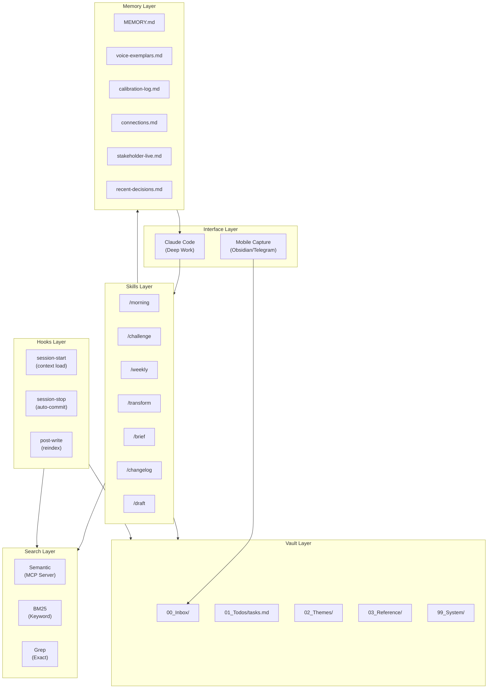

# System Overview

## What

Quartermaster (QM) is an agentic operating system for Claude Code. It turns a markdown vault into a persistent, self-improving assistant that remembers context, automates workflows, and gets smarter every week.

The metaphor: a quartermaster manages logistics, navigation, and records so the commander focuses on decisions. QM does the same for knowledge workers - it handles filing, retrieval, prioritisation, and routine processing so you focus on judgement calls.

## Why

Claude Code is powerful but stateless. Every conversation starts from zero. QM solves this by wrapping Claude Code in a persistent architecture: memory files survive between sessions, hooks automate context loading and cleanup, skills encode repeatable workflows as SOPs, and search makes the entire vault queryable.

## How

Six layers, each independent but reinforcing:

1. **Interface** - Mobile capture (Obsidian, Telegram) for quick input. Claude Code for deep work sessions.
2. **Vault** - Five numbered folders. Plain markdown. Obsidian-compatible. The single source of truth.
3. **Skills** - Seven published SKILL.md files. Each encodes a workflow as a standard operating procedure Claude Code executes on command.
4. **Hooks** - Three automation points. Context loads on session start, changes commit on session stop, search reindexes after every file write.
5. **Memory** - Six files that persist across conversations. Strategic state, voice calibration, rejection patterns, cross-theme connections.
6. **Search** - Three modes (semantic, keyword, exact) queried in parallel for research tasks.

## Key Insight

The system's value compounds. Every session generates calibration data, improvement suggestions, and cross-theme connections. These feed back into the operating rules. After 8 weeks of use, the CLAUDE.md instruction file contains dozens of rules that were discovered through use, not designed upfront.

## Customisation Points

- **Add themes** by creating folders in `02_Themes/` with a `claude.md` file
- **Add skills** by writing a SKILL.md file in `.claude/skills/`
- **Adjust memory** by editing which files auto-load via MEMORY.md
- **Swap search models** by changing the sentence-transformer model in the indexer
- **Modify hooks** by editing shell scripts in `.claude/hooks/`
