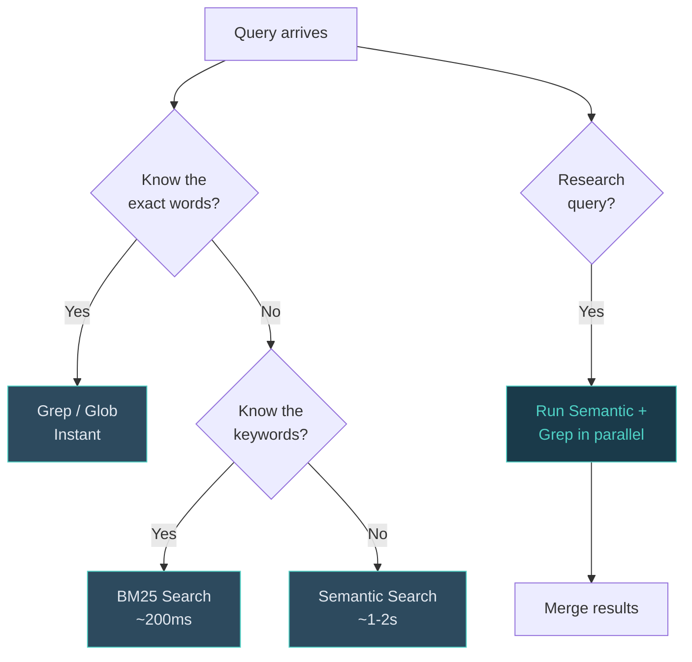

# Three-Mode Search

!!! abstract "TL;DR"
    Three search modes for different needs: **semantic** (conceptual, catches synonyms), **BM25** (keyword-ranked, fast), **grep/glob** (exact match, instant). For research queries, run semantic + grep in parallel. No external database required.

## What

QM provides three search modes that serve different query types: semantic (conceptual), BM25 (keyword-ranked), and grep/glob (exact match). For research queries, run semantic and grep in parallel to catch what either would miss alone.

## Why

No single search mode works for everything. "What have we discussed about organisational resistance?" needs semantic understanding - the vault might use words like "pushback", "blockers", or "change fatigue" without ever saying "resistance". But "find the file with the Q3 budget number" needs exact matching. BM25 sits between: it ranks by keyword frequency without semantic drift.

Three modes, each with a clear use case. The decision table makes selection automatic.

## How

### Query Routing

### Mode 1: Semantic Search (MCP Server)

Built as a Model Context Protocol server. Uses `sentence-transformers` (all-MiniLM-L6-v2, 384 dimensions) with numpy-based vector storage. No database dependency.

**How it works:**

1. The indexer crawls the vault, splitting markdown files into chunks at heading boundaries
2. Each chunk is embedded into a 384-dimensional vector
3. Vectors and metadata are stored as numpy arrays and JSON
4. At query time, the query is embedded and compared via cosine similarity
5. Top results return with file paths, heading context, and relevance scores

**Best for:** Conceptual queries where you don't know the exact words. "Prior decisions on pricing strategy." "What did we learn from the pilot?"

### Mode 2: BM25 Keyword Search

Fast ranked keyword search. Returns files ordered by term frequency and relevance. Runs via `qmd search` command, typically completing in under 200ms.

**Best for:** When you know the keywords but want ranked results. "consulting contract." "EBITDA bridge."

### Mode 3: Grep/Glob (Exact Match)

Standard pattern matching. Grep for exact strings in file content. Glob for file path patterns.

**Best for:** Specific lookups. An exact phrase, a file name, a dated meeting note pattern like `meetings/2026-02-*.md`.

### Decision Table

| You need... | Use | Example |
|---|---|---|
| Conceptual match, don't know exact words | Semantic | "discussions about team resistance" |
| Keyword ranking without drift | BM25 | "consulting proposal terms" |
| Exact string or file path | Grep/Glob | `grep "£2M"` or `glob "meetings/*.md"` |
| Research (comprehensive) | Semantic + Grep in parallel | Run both, merge results |

### Reindexing

- **BM25:** `qmd update` - runs automatically on session start and after every file write (~200ms)
- **Semantic:** `./99_System/qm-search/reindex` - runs on session stop (~15s). Manual trigger after large batch imports
- **Grep:** No index. Always current.

### The Parallel Search Pattern

For any non-trivial research query, run semantic and grep/glob simultaneously. Semantic catches synonyms and related concepts. Grep catches exact terms semantic might miss (names, numbers, abbreviations). The union of both produces the most reliable results.

## Key Insight

Search quality determines system usability. If you can't find what you filed, filing is wasted effort. Three modes with a clear decision table means the right search is always one question away.

## Customisation Points

- **Swap the embedding model** for domain-specific performance (e.g., legal, medical)
- **Adjust chunk boundaries** - heading-based splitting works for most vaults, but you can chunk by paragraph or fixed size
- **Add search modes** - e.g., date-range filtering, tag-based queries
- **Tune reindex frequency** based on your write volume

## Related

- [System Overview](overview.md) - Where search sits in the seven-layer architecture
- [Three-Hook Automation](hooks.md) - The post-write hook triggers BM25 reindex after every edit
- [Skills System](skills-system.md) - Skills use parallel search during their gather phase
