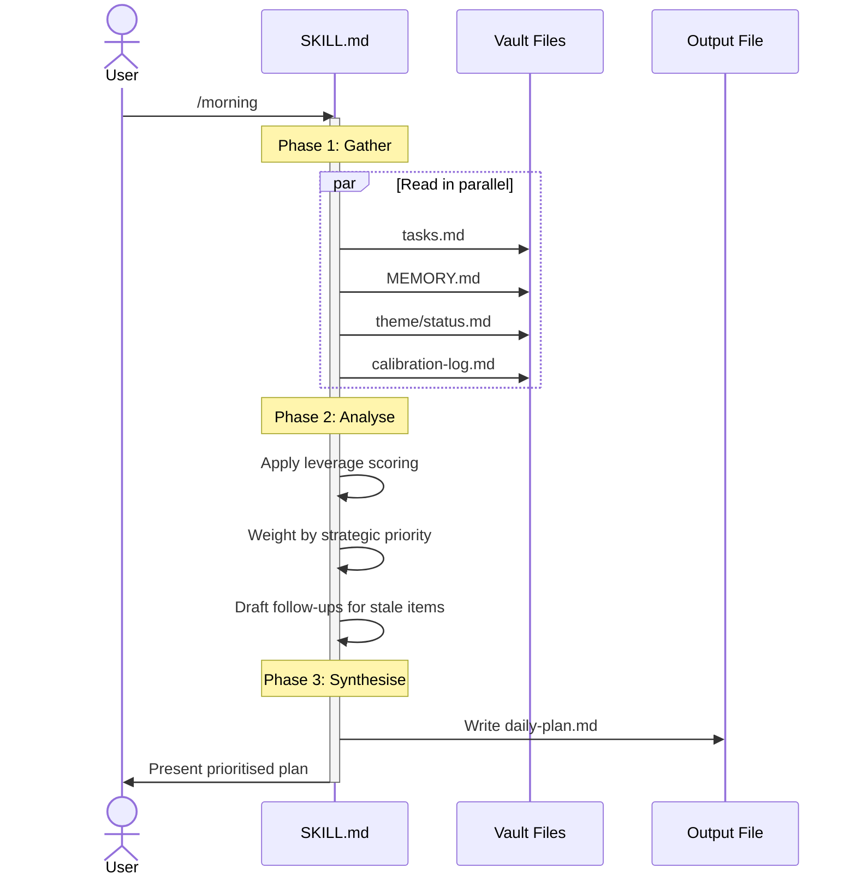

# Skills System

!!! abstract "TL;DR"
    Skills are SKILL.md files that act as SOPs for Claude Code. Type `/morning` and Claude follows a step-by-step procedure. Seven published skills cover daily planning, meeting prep, document review, content creation, and weekly maintenance. Write your own in under 10 minutes.

## What

A skill is a SKILL.md file that acts as a standard operating procedure (SOP) for Claude Code. When you type `/morning`, Claude reads the corresponding SKILL.md and follows its instructions step by step. Skills are versionable, inspectable, and modular - plain markdown files checked into git.

## Why

System prompts are invisible and monolithic. SKILL.md files fix both problems. You can read them, edit them, diff them, and share them. Each skill owns one workflow. When a skill breaks, you fix one file. When you want a new capability, you write one file.

The alternative - cramming everything into CLAUDE.md - produces a bloated instruction file that Claude struggles to follow consistently. Skills decompose that complexity into focused, testable units.

## How

### SKILL.md Format

Every skill starts with YAML frontmatter:

```yaml
---
name: morning
description: Generate daily plan with AI prioritisation. Run every morning (5 min).
argument-hint:
allowed-tools: Read, Write, Bash, Glob
model: sonnet
---
```

Key fields:

- **name** - The slash command trigger
- **description** - What it does and how long it takes
- **allowed-tools** - Which Claude Code tools the skill can use (security boundary)
- **model** - Which model to use (sonnet for routine work, opus for strategic analysis)

Below the frontmatter, the skill body defines the procedure: what to read, how to process, what to output.

### The Gather-Analyse-Synthesise Pattern

Most skills follow the same three-phase structure:



1. **Gather context** - Read vault files in parallel (tasks, theme status, memory)
2. **Analyse** - Apply domain logic (prioritisation, scoring, pattern matching)
3. **Output** - Write results to a specific file or present to the user

Skills can spawn Task subagents for parallel execution. The `/morning` skill, for example, reads tasks and four theme status files simultaneously before synthesising priorities.

### Published Skills

| Skill | Purpose | Runtime |
|---|---|---|
| `/morning` | Daily prioritised plan | ~5 min |
| `/weekly` | Archive, audit, review | ~10 min |
| `/transform` | Process content into vault | ~5 min |
| `/challenge` | Red team / critical review | ~5 min |
| `/brief` | Fast pre-meeting one-pager | ~2 min |
| `/draft` | Outbound content (emails, LinkedIn) | ~5 min |
| `/changelog` | Inspect iteration decisions | ~1 min |

### Creating Your Own Skill

1. Create `.claude/skills/[name]/SKILL.md`
2. Add YAML frontmatter with name, description, allowed-tools
3. Write the procedure as numbered steps
4. Reference vault paths explicitly (skills should be self-contained)
5. Test by running `/[name]` in Claude Code

## Key Insight

Skills are SOPs for an AI employee. The same principle applies: if you wouldn't trust a new hire to figure out a workflow from scratch every time, write it down. The SKILL.md file is the written procedure.

## Customisation Points

- **Model selection** per skill - use cheaper models for routine work
- **Tool restrictions** - limit what each skill can access
- **Argument passing** - skills can accept parameters (e.g., `/brief #project-a @alex`)
- **Nesting** - skills can reference other skills' outputs

## Related

- [System Overview](overview.md) - Where skills sit in the six-layer architecture
- [Three-Mode Search](search.md) - Skills use parallel search during the gather phase
- [Six-File Memory](memory-system.md) - Skills read memory files for context
- [Self-Improvement Loop](self-improvement.md) - Sessions generate improvement suggestions that refine skill behaviour
