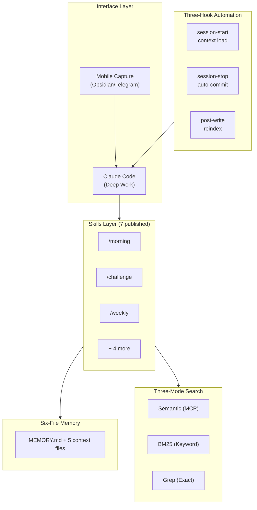

# Quartermaster

I built an agentic operating system for my work. Here's how.

Claude Code is powerful but stateless. Every conversation starts from zero. I needed something that compounds - where every correction becomes a permanent rule, every session builds institutional memory, and workflows that took 30 minutes shrink to 5.

Quartermaster is the result: 7 published skills, a three-hook automation layer, a six-file persistent memory system, local semantic search over a markdown vault, and a self-improvement loop that promotes recurring patterns into system rules.

[Get Started](quickstart.md){ .md-button .md-button--primary }
[View on GitHub](https://github.com/sovrana/qm-os){ .md-button }

## What a Day Looks Like

**8:30am** - Open Claude Code. The session-start hook loads a dashboard: 3 tasks due today, 2 items waiting on people for 7+ days, 14 unprocessed inbox items. Claude already knows what matters.

**8:31am** - `/morning`. Claude reads your tasks, applies leverage scoring (Impact / Effort), checks strategic priorities from MEMORY.md, and generates a prioritised daily plan. High-impact, low-effort items surface first.

**9:00am** - Before a meeting, `/brief #project-a Alex`. Claude pulls the last 3 meeting notes, open tasks, waiting items, and stakeholder preferences into a one-pager. Includes "what NOT to say" based on political context.

**11:00am** - `/challenge` on a strategy doc before sharing it with the board. Five parallel analysis lenses run simultaneously: logical holes, evidence gaps, audience fit, political risk, blind spot check.

**5:00pm** - Session ends. The stop hook auto-commits all changes. Search reindexes. Nothing is lost.

**Sunday** - `/weekly` runs 7 parallel subagents: task audit, stale item cleanup, memory review, cross-theme connection discovery, improvement suggestions, and more. The system gets smarter every week.

## Architecture

## This Site

**[Quickstart](quickstart.md)** - Get running in 30 minutes.

**[Architecture](architecture/overview.md)** - How the six layers work together.

**[Skills](skills/morning.md)** - Deep dives into each of the 7 published skills.

**[Reference](reference/quartermaster-md.md)** - The full CLAUDE.md template, task format, anti-slop rules, and rules system.

**[About](about.md)** - Who built this and why.
