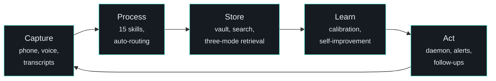
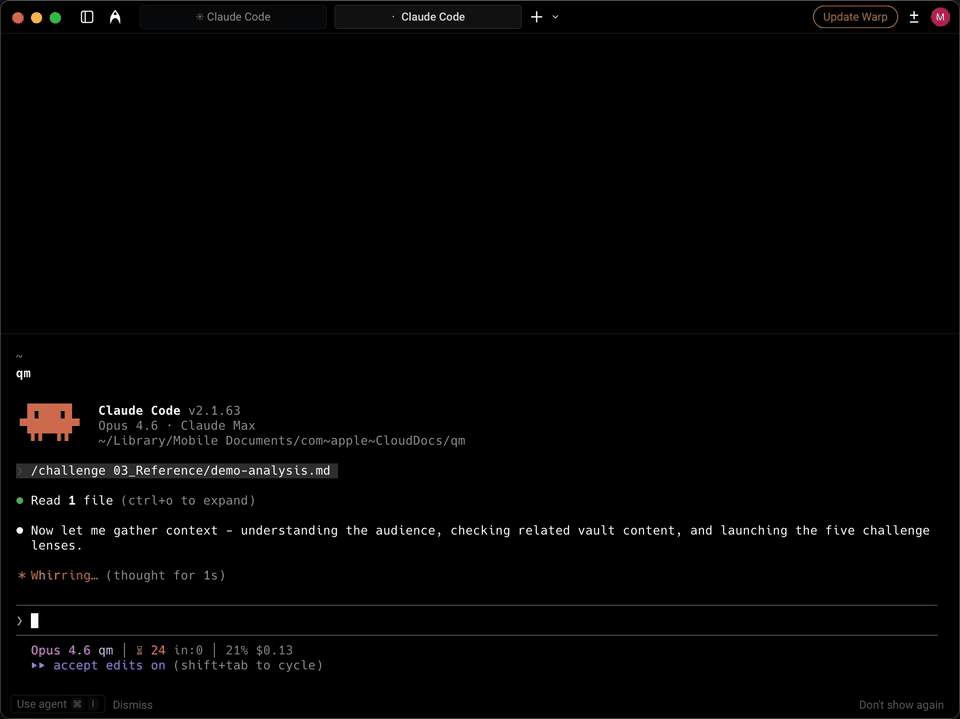

---
hide:
  - toc
---

<div class="hero-intro" markdown>

# Quartermaster

<p class="subtitle">An AI operating system that runs locally, owns your files, remembers everything, and learns from every correction. Built on Claude Code and Obsidian. Re-explaining context every morning is a stupid use of time.</p>

[Get Started](quickstart.md){ .md-button .md-button--primary }
[What's Different](what-makes-this-different.md){ .md-button }
[GitHub](https://github.com/sovrana/qm-os){ .md-button }

</div>


<div class="arch-summary" markdown>



<p class="arch-caption">Five stages, one loop. Everything flows through a markdown vault. <a href="architecture/overview/">Full architecture →</a></p>

</div>

<p class="section-label">Who this is for</p>

## Built for people who

- **Use AI for real work** - whether ChatGPT, Claude, or Claude Code - and want something that compounds instead of resetting every session
- **Manage multiple domains** with different stakeholders, contexts, and communication styles
- **Process meetings and transcripts** and need decisions, actions, and insights extracted automatically
- **Want an AI that works between sessions** - processing your inbox, flagging slipping tasks, sending you a morning plan before you open your laptop
- **Build AI systems** and want battle-tested architecture patterns for memory, search, self-improvement, and agent orchestration

Whether you're new to Claude Code or pushing its limits, [pick your starting point →](new-to-claude-code.md)

<p class="section-label">What's genuinely new</p>

## Three things I haven't seen anywhere else

<div class="features features-novel" markdown>
<div class="feature" markdown>
<div class="feature-icon">🔄</div>
<div class="feature-text" markdown>
<strong>It rewrites its own instructions</strong>
<span>Corrections log to a calibration file. Patterns that appear 3+ times graduate to permanent rules. After 2 months: 130+ suggestions extracted, 7 graduated to permanent rules, each eliminating a recurring friction point. Every change is auditable - the calibration log shows exactly what changed and why. You don't configure it. You grow it. [See real examples →](architecture/in-production.md)</span>
</div>
</div>
<div class="feature" markdown>
<div class="feature-icon">🔴</div>
<div class="feature-text" markdown>
<strong>Five-lens red team on every important document</strong>
<span>/challenge runs 5 independent agents in parallel: audience fit, logic gaps, vault contradictions, your known blind spots, and a pre-mortem. Independent execution means no anchoring - the pre-mortem doesn't know what the audience-fit lens found. Verdict + top 3 fixes in one pass.</span>
</div>
</div>
<div class="feature" markdown>
<div class="feature-icon">📝</div>
<div class="feature-text" markdown>
<strong>It remembers why you decided what you decided</strong>
<span>Every structural change logged with reasoning. Contradiction detection catches when you reverse a previous decision: "This reverses the decision to remove the budget table. Intentional?" Rejected alternatives become permanent constraints unless consciously overturned.</span>
</div>
</div>
</div>

<p class="section-label">The operational backbone</p>

## And five things done well

<div class="features features-backbone" markdown>
<div class="feature" markdown>
<div class="feature-icon">🌙</div>
<div class="feature-text" markdown>
<strong>It never sleeps</strong>
<span>A daemon runs 24/7 on a second machine. Hourly heartbeat processes your inbox, flags slipping tasks, sends a morning plan to your phone before you wake up. The concept: agency between sessions. My implementation: a Telegram bot on a spare Mac. Yours could be a cron job on a VPS.</span>
</div>
</div>
<div class="feature" markdown>
<div class="feature-icon">🎙️</div>
<div class="feature-text" markdown>
<strong>Meetings become permanent, searchable knowledge</strong>
<span>Drop a transcript, walk away. The system auto-detects the theme, extracts decisions and actions, routes everything to the right folder. The concept: autonomous transcript-to-knowledge pipeline. My implementation: MacWhisper + iCloud. Yours could be Whisper + Dropbox + any transcription tool.</span>
</div>
</div>
<div class="feature" markdown>
<div class="feature-icon">📋</div>
<div class="feature-text" markdown>
<strong>Tasks managed like a chief of staff</strong>
<span>Leverage scoring (Impact x Effort) trumps due dates. Strategic weighting from live priorities. Waiting items age and trigger auto-drafted follow-ups after 7 days. The concept: AI-prioritised tasks that understand what actually matters this week, not just what's technically next.</span>
</div>
</div>
<div class="feature" markdown>
<div class="feature-icon">📱</div>
<div class="feature-text" markdown>
<strong>Captures from everywhere, processes centrally</strong>
<span>Phone, voice, transcripts, Telegram, share sheets, email forwarding. Everything converges on one inbox that gets processed automatically. The concept: many capture points, one processing pipeline. The tools are swappable - the architecture isn't.</span>
</div>
</div>
<div class="feature" markdown>
<div class="feature-icon">🔗</div>
<div class="feature-text" markdown>
<strong>Connected to your actual work tools</strong>
<span>Gmail search from the terminal. Markdown to rich HTML clipboard for pasting into Gmail, Word, or Outlook. Office document generation (DOCX, PPTX, XLSX). The output pipeline matters as much as the input - writing in markdown is pointless if you can't get it into the format stakeholders expect.</span>
</div>
</div>
</div>

[Read the full breakdown →](what-makes-this-different.md)

<p class="section-label">Get running in 3 steps</p>

## Quick start

```bash
# 1. Clone and copy the template
git clone https://github.com/sovrana/qm-os.git
cp -r qm-os/template/ ~/my-vault/ && cd ~/my-vault/

# 2. Customise CLAUDE.md (your name, your blind spots, your stakeholders)
# Search for CUSTOMISE - there are ~20 marked sections

# 3. Run your first morning plan
claude /morning
```

Needs: [Claude Code](https://docs.anthropic.com/en/docs/claude-code) + Python 3.10+ (for search) + Git. Full setup with semantic search and hooks takes [30 minutes →](quickstart.md)

<p class="section-label">A typical day</p>

## What a day looks like

<div class="timeline" markdown>
<div class="moment" markdown>
<span class="time">6:30am - phone buzzes</span>

Telegram: your morning plan is ready. 3 P1 items, 2 follow-ups auto-drafted for stale waiting items. A task on Alex is now at 12 days. You haven't opened your laptop.
</div>
<div class="moment" markdown>
<span class="time">9:00am - open Claude Code</span>

The session-start hook loads a dashboard: tasks due today, items waiting on people, unprocessed inbox files, high-leverage quick wins. Yesterday's context is already in memory.
</div>
<div class="moment" markdown>
<span class="time">9:15am - /brief #project-a Alex</span>

Last 3 meeting notes, open tasks, waiting items, stakeholder preferences. A "what NOT to say" section based on political context. Two minutes.
</div>
<div class="moment" markdown>
<span class="time">10:00am - meeting</span>

MacWhisper recording the call. You focus on the conversation.
</div>
<div class="moment" markdown>
<span class="time">10:45am - drop transcript, walk away</span>

The heartbeat auto-processes it: decisions, actions, insights extracted. Actions land in tasks.md tagged to the right theme. You didn't run a single command.
</div>
<div class="moment" markdown>
<span class="time">11:30am - /challenge the board paper</span>

Five parallel lenses tear it apart simultaneously. Verdict: Needs Work. Top issue: execution mechanics missing (your known blind spot, caught automatically). Three fixes pushed to your task list.
</div>
<div class="moment" markdown>
<span class="time">2:00pm - /draft linkedin</span>

Voice-calibrated against your real writing samples. Anti-slop enforced. 8 variants generated. Pick one. Copy to clipboard as rich HTML. Paste into LinkedIn.
</div>
<div class="moment" markdown>
<span class="time">5:00pm - session ends</span>

Auto-commit to git. Search reindexes. Nothing lost. Telegram: evening summary. 5/7 planned items done. Tomorrow's top 3. That waiting item on Alex is flagged for escalation.
</div>
<div class="moment" markdown>
<span class="time">Sunday - /weekly</span>

7 parallel subagents: task audit, stale item cleanup, memory refresh, cross-theme connection discovery, self-improvement suggestions, stakeholder heatmap, decision digest. The system gets smarter every week.
</div>
</div>

<div class="demo-gif" markdown>
<p class="demo-caption"><code>/challenge</code> tearing apart a strategy document - 5 parallel lenses, verdict in 2 minutes</p>


</div>

<p class="section-label">Type a command, get a result</p>

## 15 skills included

| Command | What it does | Time |
|---------|-------------|------|
| [**`/morning`**](skills/morning.md) | Prioritised daily plan with leverage scoring | ~5 min |
| [**`/brief`**](skills/brief.md) | Pre-meeting one-pager with political context | ~2 min |
| [**`/challenge`**](skills/challenge.md) | 5-lens parallel red team on any document | ~5 min |
| [**`/stress-test`**](skills/stress-test.md) | 3-persona adversarial debate | ~15 min |
| [**`/transform`**](skills/transform.md) | Transcript to structured knowledge | ~5 min |
| [**`/draft`**](skills/draft.md) | Voice-calibrated outbound content | ~5 min |
| [**`/prep`**](skills/prep.md) | Vault research before writing | ~10 min |
| [**`/prompt`**](skills/prompt.md) | Structure messy thinking into executable briefs | ~30 sec |
| [**`/capture`**](skills/capture.md) | Stress-test and store rhetorical weapons | ~30 sec |
| [**`/inbox`**](skills/inbox.md) | Process captures and route to tasks | ~5 min |
| [**`/show`**](skills/show.md) | Filtered task views by theme or person | ~30 sec |
| [**`/weekly`**](skills/weekly.md) | Full system audit with 7 parallel subagents | ~30 min |
| [**`/changelog`**](skills/changelog.md) | Iteration decisions with contradiction detection | ~1 min |
| [**`/visualise`**](skills/visualise.md) | Infographics and diagrams from vault notes | ~2 min |
| [**`/evening`**](skills/evening.md) | End-of-day reflection and pattern tracking | ~5 min |

I've built more for my own workflows: `/gmail`, `/publish`, `/clipboard`. Writing a new skill takes under 10 minutes. [How skills work →](architecture/skills-system.md)

[Browse all skills →](skills/morning.md)

<div class="cta-bar" markdown>
[Quickstart (30 min) →](quickstart.md){ .md-button .md-button--primary }
[Architecture deep dive →](architecture/overview.md){ .md-button }
[View on GitHub](https://github.com/sovrana/qm-os){ .md-button }
</div>

<div class="feedback-line" markdown>
Built with [Claude Code](https://docs.anthropic.com/en/docs/claude-code) and [Material for MkDocs](https://squidfunk.github.io/mkdocs-material/). Something broken? [Open an issue](https://github.com/sovrana/qm-os/issues) or [start a discussion](https://github.com/sovrana/qm-os/discussions).
</div>
