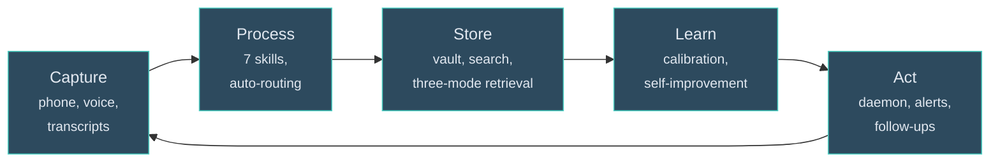

---
hide:
  - toc
---

<div class="hero-intro" markdown>

# Quartermaster

<p class="subtitle">A personal AI operating system that runs 24/7, captures from every device, processes meetings autonomously, manages your tasks, red-teams your work, and gets smarter every week. Built by a PE exec who got tired of re-explaining context every morning.</p>

[Get Started](quickstart.md){ .md-button .md-button--primary }
[What's Different](what-makes-this-different.md){ .md-button }
[GitHub](https://github.com/sovrana/qm-os){ .md-button }

</div>

<div class="intro-note" markdown>
I run AI transformation at [Warburg Pincus](https://www.warburgpincus.com/). Five workstreams, multiple portfolio companies, no engineering team. Before that: McKinsey, then running billion-pound businesses at Lloyds. I needed an AI that works while I sleep and gets better without me asking. So I built one. 8 weeks of production use. Open source. [Who I am →](about.md)
</div>

<div class="arch-summary" markdown>



<p class="arch-caption">Five stages, one loop. Everything flows through a markdown vault. <a href="architecture/overview.md">Full architecture →</a></p>

</div>

<p class="section-label">Who this is for</p>

## Built for people who

- **Use AI for real work** - whether ChatGPT, Claude, or Claude Code - and want something that compounds instead of resetting every session
- **Manage multiple workstreams** with different stakeholders, contexts, and communication styles
- **Process meetings and transcripts** and need decisions, actions, and insights extracted automatically
- **Want an AI that works between sessions** - processing your inbox, flagging slipping tasks, sending you a morning plan before you open your laptop
- **Build AI systems** and want battle-tested architecture patterns for memory, search, self-improvement, and agent orchestration

Whether you're new to Claude Code or pushing its limits, [pick your starting point →](new-to-claude-code.md)

<p class="section-label">What makes this different</p>

## Eight things nothing else does

<div class="features" markdown>
<div class="feature" markdown>
<div class="feature-icon">🌙</div>
<div class="feature-text" markdown>
<strong>It never sleeps</strong>
<span>A daemon runs 24/7 on a second machine. Hourly heartbeat processes your inbox, flags slipping tasks via Telegram, sends a prioritised morning plan to your phone before you wake up, and an evening summary when you stop. The system has agency between sessions.</span>
</div>
</div>
<div class="feature" markdown>
<div class="feature-icon">🎙️</div>
<div class="feature-text" markdown>
<strong>Meetings become permanent, searchable knowledge</strong>
<span>Record with MacWhisper, drop the transcript. The system auto-detects the theme, extracts decisions, actions, and insights, routes everything to the right folder. Files under 5,000 words process autonomously. You don't even need to be at your desk.</span>
</div>
</div>
<div class="feature" markdown>
<div class="feature-icon">📋</div>
<div class="feature-text" markdown>
<strong>Tasks managed like a chief of staff</strong>
<span>Leverage scoring (Impact x Effort) trumps due dates. Strategic weighting from live priorities. Waiting items age and trigger auto-drafted follow-ups. Proactive Telegram alerts when items slip past 7 days. Weekly audit surfaces what fell through cracks.</span>
</div>
</div>
<div class="feature" markdown>
<div class="feature-icon">🔴</div>
<div class="feature-text" markdown>
<strong>Five-lens red team on every important document</strong>
<span>Before anything goes to the board, /challenge runs 5 independent agents in parallel: audience fit, logic gaps, vault contradictions, your known blind spots, and a pre-mortem. Independent execution means no anchoring. Verdict + top 3 fixes in one pass.</span>
</div>
</div>
<div class="feature" markdown>
<div class="feature-icon">🔄</div>
<div class="feature-text" markdown>
<strong>It rewrites its own instructions</strong>
<span>Corrections log to a calibration file. Patterns that appear 3+ times graduate to permanent rules. A weekly review surfaces improvements. After a month, the system knows your preferences better than most human assistants. You don't configure it. You grow it. [See real examples →](architecture/in-production.md)</span>
</div>
</div>
<div class="feature" markdown>
<div class="feature-icon">📱</div>
<div class="feature-text" markdown>
<strong>Captures from everywhere, processes centrally</strong>
<span>Obsidian on your phone. iOS Shortcuts for voice capture ("Hey Siri, QM capture"). Telegram for remote task entry. MacWhisper for transcripts. Share sheet from any app. Everything converges on one inbox that gets processed automatically.</span>
</div>
</div>
<div class="feature" markdown>
<div class="feature-icon">🔗</div>
<div class="feature-text" markdown>
<strong>Connected to your actual work tools</strong>
<span>Gmail search from the terminal. Corporate Outlook and calendar via browser automation. Markdown to rich HTML clipboard for pasting into Gmail, Word, or Outlook. Office document generation (DOCX, PPTX, XLSX). School emails filtered and summarised.</span>
</div>
</div>
<div class="feature" markdown>
<div class="feature-icon">📝</div>
<div class="feature-text" markdown>
<strong>It remembers why you decided what you decided</strong>
<span>Every structural change logged with reasoning. Contradiction detection catches when you reverse a previous decision: "This reverses the decision to remove the budget table. Intentional?" No accidentally relitigating settled questions.</span>
</div>
</div>
</div>

[Read the full breakdown →](what-makes-this-different.md)

<p class="section-label">Get running in 3 steps</p>

## Quick start

```bash
# 1. Clone and copy the template
git clone https://github.com/sovrana/qm-os.git
cp -r qm-os/template/ ~/my-vault/ && cd ~/my-vault/

# 2. Customise CLAUDE.md (your name, your blind spots, your stakeholders)
# Search for CUSTOMISE - there are ~20 marked sections

# 3. Run your first morning plan
claude /morning
```

Needs: [Claude Code](https://docs.anthropic.com/en/docs/claude-code) + Python 3.10+ (for search) + Git. Full setup with semantic search and hooks takes [30 minutes →](quickstart.md)

<p class="section-label">A typical day</p>

## What a day looks like

<div class="timeline" markdown>
<div class="moment" markdown>
<span class="time">6:30am - phone buzzes</span>

Telegram: your morning plan is ready. 3 P1 items, 2 follow-ups auto-drafted for stale waiting items. A task on Sean is now at 12 days. You haven't opened your laptop.
</div>
<div class="moment" markdown>
<span class="time">9:00am - open Claude Code</span>

The session-start hook loads a dashboard: tasks due today, items waiting on people, unprocessed inbox files, high-leverage quick wins. Yesterday's context is already in memory.
</div>
<div class="moment" markdown>
<span class="time">9:15am - /brief #project-a Alex</span>

Last 3 meeting notes, open tasks, waiting items, stakeholder preferences. A "what NOT to say" section based on political context. Two minutes.
</div>
<div class="moment" markdown>
<span class="time">10:00am - meeting</span>

MacWhisper recording the call. You focus on the conversation.
</div>
<div class="moment" markdown>
<span class="time">10:45am - drop transcript, walk away</span>

The heartbeat auto-processes it: decisions, actions, insights extracted. Actions land in tasks.md tagged to the right theme. You didn't run a single command.
</div>
<div class="moment" markdown>
<span class="time">11:30am - /challenge the board paper</span>

Five parallel lenses tear it apart simultaneously. Verdict: Needs Work. Top issue: execution mechanics missing (your known blind spot, caught automatically). Three fixes pushed to your task list.
</div>
<div class="moment" markdown>
<span class="time">2:00pm - /draft linkedin</span>

Voice-calibrated against your real writing samples. Anti-slop enforced. 8 variants generated. Pick one. Copy to clipboard as rich HTML. Paste into LinkedIn.
</div>
<div class="moment" markdown>
<span class="time">5:00pm - session ends</span>

Auto-commit to git. Search reindexes. Nothing lost. Telegram: evening summary. 5/7 planned items done. Tomorrow's top 3. That waiting item on Sean is flagged for escalation.
</div>
<div class="moment" markdown>
<span class="time">Sunday - /weekly</span>

7 parallel subagents: task audit, stale item cleanup, memory refresh, cross-theme connection discovery, self-improvement suggestions, stakeholder heatmap, decision digest. The system gets smarter every week.
</div>
</div>

<div class="demo-gif" markdown>
<p class="demo-caption"><code>/challenge</code> tearing apart a strategy document - 5 parallel lenses, verdict in 2 minutes</p>


</div>

<p class="section-label">Type a command, get a result</p>

## 7 core skills included

| Command | What it does | Time |
|---------|-------------|------|
| [**`/morning`**](skills/morning.md) | Prioritised daily plan with leverage scoring and draft follow-ups for stale items | ~5 min |
| [**`/brief`**](skills/brief.md) | Pre-meeting one-pager: last 3 meetings, open tasks, "what NOT to say" | ~2 min |
| [**`/challenge`**](skills/challenge.md) | 5 parallel red-team lenses: audience fit, logic, contradictions, blind spots, pre-mortem | ~5 min |
| [**`/transform`**](skills/transform.md) | Process transcript into structured knowledge: decisions, actions, insights, routing | ~5 min |
| [**`/draft`**](skills/draft.md) | Voice-calibrated outbound content: LinkedIn, emails, memos. Batch options for short-form | ~5 min |
| [**`/weekly`**](skills/weekly.md) | Full system audit: 7 parallel subagents for task cleanup, memory refresh, self-improvement | ~30 min |
| [**`/changelog`**](skills/changelog.md) | View or log iteration decisions. Contradiction detection built in | ~1 min |

I've built another 10+ for my own workflows: `/inbox`, `/gmail`, `/prep`, `/publish`, `/show`, `/evening`. Writing a new skill takes under 10 minutes. [How skills work →](architecture/skills-system.md)

[Browse all skills →](skills/morning.md)

<div class="cta-bar" markdown>
[Quickstart (30 min) →](quickstart.md){ .md-button .md-button--primary }
[Architecture deep dive →](architecture/overview.md){ .md-button }
[Star the repo](https://github.com/sovrana/qm-os){ .md-button }
</div>

<div class="feedback-line" markdown>
Built with [Claude Code](https://docs.anthropic.com/en/docs/claude-code) and [Material for MkDocs](https://squidfunk.github.io/mkdocs-material/). Something broken? [Open an issue](https://github.com/sovrana/qm-os/issues) or [start a discussion](https://github.com/sovrana/qm-os/discussions).
</div>
