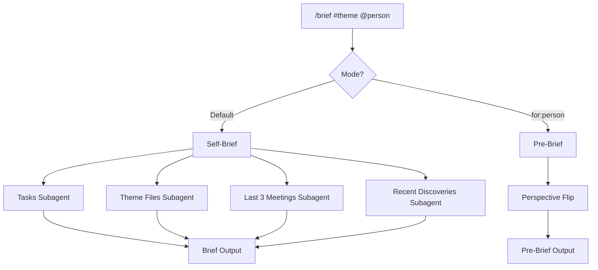

# /brief - Meeting Prep

## What It Does

Generates a fast, opinionated pre-meeting one-pager in under 2 minutes. Pulls tasks, recent meeting history, theme status, and stakeholder context into a single view you can scan before walking into a room.

## Why It Matters

You know the feeling: meeting starts in 3 minutes, you can't remember what was agreed last time, what you owe them, or what they owe you. You scramble through notes and find nothing useful in time.

`/brief` solves this by assembling context from across the vault, filtered to the specific person and theme you're about to discuss. Speed over depth. This is a context reload, not a research project. (For deep research, build a custom `/prep` skill.)

## How It Works



Four parallel subagents gather context simultaneously:

| Subagent | Searches |
|----------|----------|
| **Tasks** | Open tasks tagged with the theme, @waiting() items involving the person, overdue items, @agenda() tags |
| **Theme Files** | `status.md` (Now/Next/Blockers), `claude.md` (political context), `people.md` (communication style), cross-theme connections |
| **Meeting Notes** | Last 3 meetings only - decisions, open questions, action items |
| **Discoveries** | Conversation discovery logs from the past 2 weeks mentioning the theme or person |

Output goes to stdout. No file created. This is ephemeral.

## The Key Innovation

**Two modes with a perspective flip.**

**Self-brief** (default) answers: "What do I need to know walking in?" It shows what they owe you, what you owe them, the last meeting's outcomes, and a suggested agenda ranked by urgency.

**Pre-brief** (`for:person`) flips the question to: "What does this person need to hear from me?" The output changes completely:

- **Their Current State** - What they currently believe, when they last engaged
- **What's Changed Since** - Key shifts they don't know about yet
- **The Message** - 2-3 bullets framed for this person's priorities
- **What NOT to Say** - Topics to avoid or defer. Information that's premature or politically sensitive.
- **Their Likely Questions** - Based on their pattern in previous meetings

The "What NOT to Say" section is where pre-briefs earn their value. Knowing what to hold back is often more important than knowing what to share. This section draws from `people.md` sensitivities, political context in theme `claude.md`, and timing of decisions that aren't yet public.

## Example Usage

Self-brief before a project meeting:

```
/brief #project-a Alex
```

Pre-brief - what to tell your deal partner before Monday:

```
/brief #project-a for:Jordan monday
```

Person-focused brief across all themes:

```
/brief @Sam
```

## Customisation Guide

- **Stakeholder profiles** - The richer your `people.md` files, the sharper the pre-brief. Include communication preferences, known concerns, and recurring questions.
- **Meeting depth** - Defaults to last 3 meetings. Increase if your meetings are infrequent, decrease if you meet daily.
- **Discovery window** - Scans the last 2 weeks of conversation logs. Adjust if your pace of discovery differs.
- **Agenda items** - The suggested agenda picks the 3 most urgent items. Override by adding `@agenda(PersonName)` tags to specific tasks.
