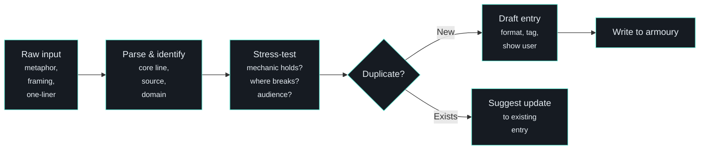

# /capture - Armoury Capture

| | |
|---|---|
| **Runtime** | ~30 seconds |
| **Reads** | `armoury.md`, existing entries for duplicate check |
| **Writes** | New entry appended to `armoury.md` |
| **Model** | Claude Code |

## What It Does

Captures a new metaphor, analogy, framing, or one-liner into the rhetorical armoury. Stress-tests it before storing - because a metaphor that breaks under mild pressure shouldn't survive to a boardroom.

## Why It Matters

Good metaphors surface at inconvenient times. Mid-conversation, walking the dog, reading something unrelated. The gap between "that's a good line" and "I can't remember what I said" is about 48 hours.

`/capture` closes that gap. Grab the line, stress-test it in 30 seconds, store it with audience tags and failure modes. It's there when you need it.

## How It Works



### Input

Three modes:

- **`/capture [line or concept]`** - Capture what you type
- **`/capture`** (no args) - Asks what you want to capture
- **Automatic** - When the system detects armoury-worthy material mid-session, it offers: "Want me to add that to the armoury?"

### The Stress Test

Before anything gets stored, `/capture` runs a quick validation (3-4 sentences, not a dissertation):

1. **Does the mechanic hold?** The underlying logic that makes the metaphor work, not just sound clever
2. **Where does it break?** Every metaphor has limits. Name them upfront
3. **What audience would this land with?** Tag it so `/draft` and `/prep` can find it later
4. **Is it genuinely new?** Check existing entries for variants or duplicates

### The Entry

Output follows the standard armoury format:

```markdown
### [Sticky Name]
**Line:** "What you'd actually say in the room."
**Mechanic:** Why it works. 1-2 sentences.
**Lands with:** [Audience] | **Status:** Raw
**Source:** [Origin, date] | **Domain:** [Topic]
**Related:** [Connected entries or frameworks]
```

All new entries start as **Raw**. Status only promotes through live use - you report it landed, it gets promoted. The system never auto-promotes.

## Edge Cases

- **Not a metaphor** - If the input is a task or question, redirects to task capture or the appropriate skill
- **Too vague** - "That thing about factories" gets a clarification request
- **Already exists** - Shows the existing entry, suggests updating rather than duplicating
- **Multiple captures** - If you fire off several in a row, captures each separately
- **Full narrative arcs** - If the metaphor has a developed story behind it, the armoury stores the punchy version and links to the full narrative in the relevant theme folder

## Example

**Input:** `/capture compound interest but for expertise`

**Stress test:**

> The mechanic holds: compound interest works because returns generate their own returns. Applied to expertise accumulation - every case processed makes the system smarter, which makes future cases faster. The compounding is real.
>
> Where it breaks: compound interest is passive (money sits there). Expertise accumulation requires active capture. Also, compound interest has a known rate; expertise compounding is harder to quantify.
>
> Lands with: CEO, Board, anyone who understands finance. The maths metaphor invites follow-up: "What's the interest rate? What's the principal?"

**Entry:**

```markdown
### Compound Interest for Expertise
**Line:** "It's like compound interest, but for expertise."
**Mechanic:** Returns generate their own returns. Every case makes
the system smarter, which makes future cases faster. The gap between
accumulators and dissipators widens daily.
**Lands with:** CEO, Board, finance-literate | **Status:** Raw
**Source:** Internal, Mar 2026 | **Domain:** AI transformation
```

**Duplicate check example:**

**Input:** `/capture "the machine that makes the machine" - Musk quote`

**Response:** "This is already in the armoury as 'Gigafactory for Services' (Proven). Want me to add the exact Musk quote as an alternative line?"

## Design Principles

- **Speed over perfection.** Raw entries are fine. The point is capture, not polish
- **Honest stress-testing.** A metaphor that breaks under mild scrutiny shouldn't reach a boardroom. Better to know now
- **No auto-promotion.** Status only changes through reported live use. Sounding clever on paper means nothing
- **Portable, punchy stuff only.** Full narrative arcs and developed stories stay in their source files. The armoury stores the line you'd deploy in 15 seconds

## Where It Fits

`/capture` is the intake valve for the armoury. It sits alongside the broader content pipeline:

```
/capture -> armoury.md -> /draft (weaves in relevant entries)
/capture -> armoury.md -> /prep (surfaces for meeting prep)
session -> "Want me to add that?" -> /capture
```

## Related

- [Armoury Reference](../reference/armoury.md) - The armoury format and philosophy
- [/draft](draft.md) - Downstream: uses armoury entries when writing for specific audiences
- [/prompt](prompt.md) - Upstream: structures raw thinking, which may surface armoury candidates
- [Skills System](../architecture/skills-system.md) - How skills compose with each other
