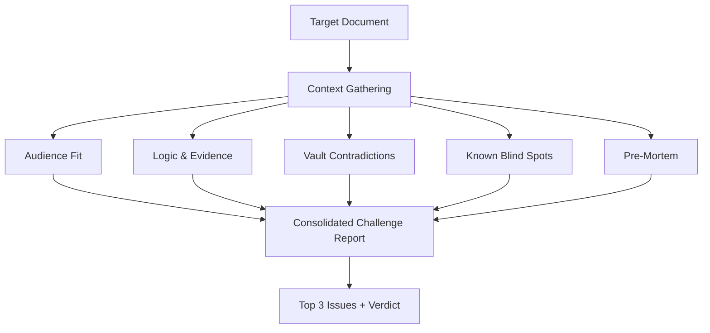

# /challenge - Red-Team Review

## What It Does

Stress-tests any document, plan, or idea through five parallel analysis lenses before it leaves the building. Returns a verdict, the top issues to fix, and a pre-mortem of how it fails.

## Why It Matters

Every important document has blind spots. The author can't see them because they built the argument. A single reviewer applies one perspective. Serial critique is slow and tends to anchor on the first problem found.

`/challenge` runs five independent reviewers simultaneously, each looking through a different lens. The result arrives in one pass, not five rounds of "what do you think?"

## How It Works



1. **Identify target** - Accepts a file path, topic keyword, or (with no arguments) challenges whatever you've been working on this session
2. **Gather context** - Reads theme files, stakeholder profiles, and previous versions to understand what the document is trying to do and for whom
3. **Launch five parallel subagents** - Each receives the full document plus context, each applies its specific lens
4. **Consolidate** - Merges findings into a single report with a verdict (Strong / Needs Work / Weak)
5. **Extract tasks** - Any actionable fixes go straight into `tasks.md`

## The Key Innovation

**Parallel lenses, not sequential critique.** The five subagents run simultaneously as Task workers:

1. **Audience Fit** - Would the target reader actually finish this? Does it match their stated communication preferences from `people.md`? Is the ask clear in the first 30 seconds?
2. **Logic & Evidence** - Are claims backed by specific numbers or just directional language? Would a sceptic find it compelling?
3. **Vault Contradictions** - Searches the vault for conflicts. Has the positioning shifted without acknowledging the change? Do prior meeting notes contradict what's being proposed?
4. **Known Blind Spots** - Applies your documented blind spots from CLAUDE.md. Architecture without execution mechanics? Culture angle missing? Greenfield bias showing?
5. **Pre-Mortem** - How does this fail? Top 3 failure modes, strongest counter-argument, the question your audience will ask that isn't answered.

This matters because a single sequential review anchors on one perspective. Parallel execution means the pre-mortem doesn't know what the audience-fit lens found, and vice versa. Independent analysis produces genuinely different angles.

## Example Usage

```
/challenge 02_Themes/unity/emails/2026-02-25_board-update.md
```

Or challenge by topic:

```
/challenge board presentation on AI transformation ROI
```

Or challenge what you've been working on:

```
/challenge
```

Output includes a verdict, the top 3 fixes, and specific sections for each lens. The "What's Actually Good" section prevents the review from feeling purely negative - but it never contains filler praise.

## Customisation Guide

- **Blind spots** - The fourth lens pulls from your Known Blind Spots section in CLAUDE.md. The more specific your blind spots, the more useful this lens becomes. Review quarterly.
- **Stakeholder profiles** - Audience Fit checks `people.md` for communication preferences. Richer profiles produce sharper audience analysis.
- **Vault depth** - The Vault Contradictions lens searches meeting notes, emails, and status docs. The more history in your vault, the more contradictions it catches.
- **Stakes calibration** - The skill scales effort to consequence. A Slack message gets a lighter treatment than a board paper. You can override by saying "full challenge" or "quick challenge".
