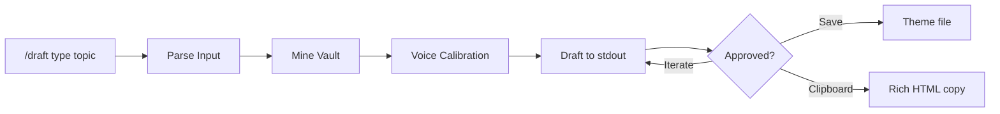

# /draft - Content Creation

## What It Does

Generates outbound content - LinkedIn posts, stakeholder emails, thought leadership pieces, internal memos - synthesised from vault context. Turns your internal thinking into external positioning.

## Why It Matters

Writing from scratch is slow. Writing from a vault full of refined thinking, meeting notes, and framework definitions is fast. The problem is that internal language doesn't translate directly to external audiences.

`/draft` bridges this gap. It mines your vault for source material, applies voice calibration from real writing samples, enforces anti-slop rules as hard constraints, and adapts framing per audience.

## How It Works



1. **Parse** - Identifies content type (linkedin, thread, email, memo), topic, and target audience
2. **Mine the vault** - Semantic search for conceptual context plus grep for specific framework definitions, meeting proof points, and prior emails for tone calibration
3. **Voice calibration** - Reads `voice-exemplars.md` and matches your actual writing cadence, not generic executive prose
4. **Draft** - Writes to stdout first. Never saves until you approve.
5. **Present** - Offers three paths: iterate, save to theme folder, or copy to clipboard as rich HTML

### Content Types

| Type | Length | Key Constraint |
|------|--------|---------------|
| `linkedin` | 150-250 words | One idea. Hook in first line. End with a question, not a summary. |
| `thread` | 3-5 posts | Each stands alone but builds. First post hooks, last post provokes. |
| `email` | Varies | Stakeholder-specific framing from `claude.md`. Prose flow, not memo format. |
| `memo` | 1-2 pages | Decisions and asks up front. Evidence-backed. Target audience stated. |

## The Key Innovation

**Three things separate this from "write me a LinkedIn post":**

**Voice calibration from exemplars.** The skill reads `voice-exemplars.md` - real samples of your writing at its best. It matches your actual cadence: sentence length variation, verb choices, level of specificity. Not "write in a professional tone" but "match this specific person's writing patterns."

**Anti-slop as hard constraints.** Every banned word, phrase, and structure from the Anti-Slop Rules applies double to outbound content. No "delve", no em dashes, no "in the fast-paced world of". External content that reads like AI output defeats the purpose. These aren't suggestions - they're compile errors.

**Batch options for short-form content.** For LinkedIn hooks, taglines, and email subject lines, the skill generates 5-10 variants instead of iterating one proposal at a time. You pick faster from breadth than from repeated depth. Single-proposal iteration produces 5+ rejection cycles. Batch options resolve in one round.

The skill also applies challenge criteria *during* drafting, not after. Audience fit, confidentiality of specific numbers, tone for recipient - all checked before the first draft hits the screen. No waiting for a post-hoc `/challenge` to catch issues that should never have been written.

## Example Usage

LinkedIn post about a framework:

```
/draft linkedin professional work architecture
```

Stakeholder update email:

```
/draft email project-update Jordan
```

LinkedIn thread:

```
/draft thread why most AI transformations fail
```

## Customisation Guide

- **Voice exemplars** - Create `99_System/context/voice-exemplars.md` with 3-5 real writing samples. The skill calibrates against these. Without exemplars, it falls back to CLAUDE.md style rules, which are less precise.
- **LinkedIn voice vs internal voice** - The skill translates internal language to external automatically. Technical labels become plain language. Basis points become percentages. Framework jargon becomes "one memorable label." Override this mapping in the SKILL.md if needed.
- **Email style** - Follows the peer email style from CLAUDE.md: prose flow, warm opening, inclusive language, simple sign-off. Adjust per-theme in theme `claude.md` files.
- **Auto-copy** - When you say "send it" or "copy it", the skill runs `md2email` for rich HTML clipboard copy. Configure the script path in your CLAUDE.md Tools section.
