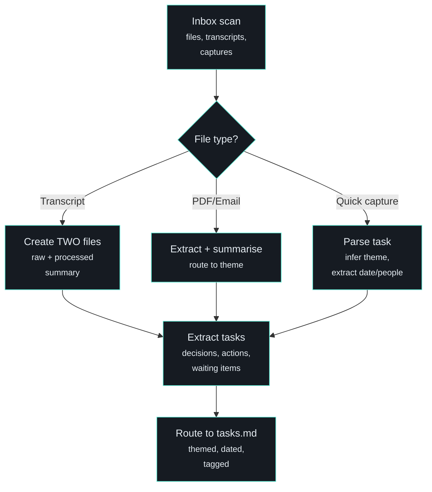

# /inbox - Process Captures and Route

| | |
|---|---|
| **Runtime** | ~5 minutes |
| **Reads** | `00_Inbox/` folder, `capture.md`, theme context files |
| **Writes** | Processed files to theme folders, tasks to `tasks.md` |
| **Model** | Claude Code |

## What It Does

Processes everything that landed in your inbox - transcripts, voice captures, PDFs, quick notes - and routes each item to the right theme folder with tasks extracted.

## Why It Matters

Capture is easy. Processing is where most systems break down. You record a meeting, dump a voice note, forward an email, save a PDF. A week later you have 30 unprocessed files and zero institutional memory.

`/inbox` is the bridge between capture and knowledge. Drop things in, they get processed, routed, and turned into searchable, actionable content. Run it end of day and nothing slips through.

## How It Works

### Two Processing Streams

**New files in `00_Inbox/`:**

- Transcripts get TWO files: raw transcript preserved, processed summary with decisions and actions extracted
- PDFs and emails get summarised and routed to the relevant theme folder
- Audio processing artifacts archived to system logs

**Quick captures in `capture.md`:**

- Parsed for task content, people, dates, blocking info
- Theme inferred from people names (strongest signal) and topic keywords
- Routed to `tasks.md` under the right section and theme heading

### Theme Routing

The system infers themes from content:

- **People names are the strongest signal** - mentions of specific stakeholders map to their theme
- **Topic keywords are secondary** - domain-specific terms help disambiguate
- **When uncertain, it asks** - "Is this for Project A or Project B?"
- **Default fallback** - personal tasks go to #personal

### Task Extraction

Tasks extracted from processed content get:

- Theme tag (`#project-a`, `#personal`)
- Due date (parsed from "tomorrow", "next Friday", "Jan 20")
- Waiting tag if someone is blocking (`@waiting(Name)`)
- Context tag if location-dependent (`@context(Home)`)
- Section routing: urgent items to In Progress, blocked items to Waiting, default to Next Up

## Automation

The inbox can run autonomously via the [always-on daemon](../architecture/always-on.md):

- Hourly heartbeat checks for new files
- Small files auto-processed, large files (>5000 words) flagged for manual review
- Processed files tracked in a manifest to prevent double-processing

## Related

- [/morning](morning.md) - Downstream: morning plan uses tasks routed by inbox
- [/transform](transform.md) - For heavy transcript processing (inbox handles light routing)
- [Always-On Daemon](../architecture/always-on.md) - Runs inbox processing automatically
- [Folder Structure](../architecture/folder-structure.md) - Where processed files end up
