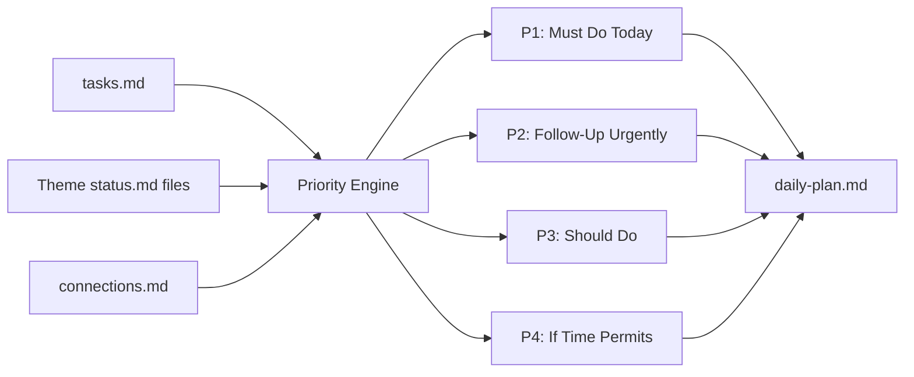

# /morning - Daily Planning

| | |
|---|---|
| **Runtime** | ~5 minutes |
| **Reads** | `tasks.md`, theme `status.md` files, `connections.md`, MEMORY.md |
| **Writes** | `01_Todos/daily-plan.md` |
| **Model** | Sonnet |

## What It Does

Generates a prioritised daily plan from your task file, theme status files, and waiting items. Runs in under 5 minutes and writes a read-only `daily-plan.md` you can check from your phone.

## Why It Matters

Most task systems sort by due date. That puts "buy trousers" above "prepare for Monday's board session" if the trousers are due today. You end up reactive, not strategic.

`/morning` fixes this by combining due dates with strategic context and a leverage scoring matrix. The result: a plan that reflects what actually matters this week, not just what's technically overdue.

## How It Works



1. **Gather** - Reads `tasks.md`, all theme `status.md` files, and the cross-theme connections register
2. **Score** - Applies the leverage matrix (Impact x Effort) alongside due dates and strategic weighting
3. **Prioritise** - Sorts into four tiers: Must Do, Follow-Up, Should Do, If Time Permits
4. **Draft follow-ups** - For stale waiting items (>7 days), generates suggested nudge messages
5. **Write** - Overwrites `01_Todos/daily-plan.md` with the result

## The Key Innovation

**Leverage scoring.** Every task can carry `!impact(H|M|L)` and `!effort(H|M|L)` tags. The engine calculates leverage as Impact divided by Effort:

| Impact | Effort | Leverage | What Happens |
|--------|--------|----------|--------------|
| H | L | **Highest** | Bumps to P1 even without a due date |
| H | M | High | Strong candidate for today |
| M | L | High | Quick wins, surface in P3 |
| L | H | **Lowest** | Flagged with "consider deferring" |

Beyond the matrix, `/morning` reads MEMORY.md's "Live Strategic State" to weight by current priority. If your biggest deal closes next week, tasks in that theme outrank routine admin regardless of due dates.

Stale waiting items (>7 days old) get draft follow-up messages. Not just a flag saying "this is old" but an actual suggested email or message you can send.

## Example Usage

```
/morning
```

Output (abbreviated):

```markdown
# Daily Plan - Thursday, 27 February 2026

## Must Do Today (2)
1. **#project-a** Prep materials for Monday session with Alex
   - Context: Deal in final stages, partnership terms under discussion
   - Connection: Platform demo reinforces technical credibility
2. **#project-b** Hand over pilot documentation to team lead
   - Due: Feb 28 (1 day remaining)

## Follow-Up Urgently (1)
### Sam (project-a) - 9 days waiting
- Alignment meeting on platform approach
- Suggested action: "Hi Sam, circling back on our discussion..."

## Should Do (3)
1. **#frameworks** Incorporate pitch items into thesis
2. **#personal** Book electrician for electrical sign-off
3. **#system** Process Tuesday's transcript
```

## Customisation Guide

- **Theme status paths** - Edit the SKILL.md to point at your actual `02_Themes/*/status.md` files
- **Leverage defaults** - Untagged tasks default to Medium/Medium. Change this in the scoring section if your work skews differently
- **Waiting thresholds** - Default escalation at 7 days. Tighten to 5 for fast-moving environments, loosen to 10 if your stakeholders move slowly
- **Weekend mode** - The skill automatically generates lighter plans on weekends, focusing on personal tasks and strategic thinking
- **Cross-theme connections** - When a task's theme appears in an active connection entry, the plan appends a one-line connection summary inline
