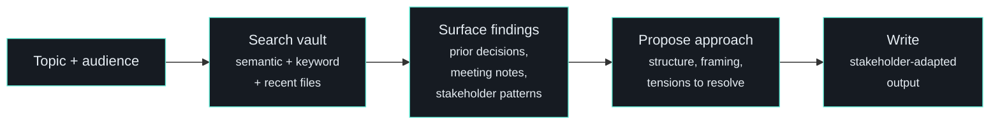

# /prep - Explore Before You Write

| | |
|---|---|
| **Runtime** | ~5-10 minutes |
| **Reads** | Vault search, theme status, meeting notes, stakeholder profiles |
| **Writes** | Surfaced context + stakeholder-adapted output |
| **Model** | Claude Code (semantic search + multi-source synthesis) |

## What It Does

Searches the vault, asks questions, and surfaces relevant context BEFORE producing content. Optional stakeholder mode adapts the output for a specific audience.

## Why It Matters

Writing a board update without reading the last three meeting notes is how you contradict your own prior positioning. Writing an email to a stakeholder without checking their communication preferences is how you send a 2-page memo to someone who reads single sentences.

`/prep` forces the research step. It searches, surfaces what it finds, proposes an approach, and only then writes.

## How It Works



### Input

Two modes:

- **`/prep [theme]`** - Explore context for a theme before writing
- **`/prep [theme] [stakeholder]`** - Explore, then produce stakeholder-adapted output

### The Exploration Phase

1. **Ask clarifying questions** - Goal, audience, constraints, prior decisions
2. **Search the vault** - Semantic search for conceptual matches, keyword search for specifics, recent files for current state
3. **Surface what was found** - "Your previous email positioned it as...", "Discovery log shows you decided X..."
4. **Propose approach** - "Based on what I found, I suggest..." / "There's a tension between X and Y"
5. **Only then write**

### Stakeholder Adaptation

When a stakeholder is specified, `/prep` applies their communication preferences. Each stakeholder profile includes preferred format, leading edge (what they care about first), and anti-patterns to avoid.

Examples of stakeholder-specific framing:

- **Investment partner** - Lead with quantified outcomes, then methodology
- **CEO** - Decisions and asks up front (table format), single sentences
- **Board** - Diagnostic questions, emotional resonance, memorable metaphors
- **Deal team** - Codified frameworks for delegation, execution playbooks

Each includes output templates so the format matches what the audience expects.

### Strategic Paper Writing

For longer-form output, `/prep` follows a writing SOP:

- **Lead with business outcomes, not internal processes**
- **Decisions and asks up front** - Don't bury the ask at the end
- **Tables extend, prose focuses** - Core message in text, detail in tables
- **Every section must answer:** "So what? Why does this reader care?"

Quality gate: "If I were the audience, reading this cold, would I know exactly what I'm being asked to decide and why it matters?"

## Edge Cases

- **Writing FOR vs ABOUT someone** - When the output is for someone to use (their document, their voice), checks every header for third-person framing
- **Multi-party negotiations** - Maps "who controls the answer" before deciding who to ask
- **Confidentiality boundaries** - Won't put commercially sensitive numbers in writing to someone without appropriate coverage

## Where It Fits

`/prep` sits upstream of `/draft` and downstream of `/prompt`:

```
/prompt (structure thinking) -> /prep (explore context) -> /draft (write it) -> /challenge (check it)
```

## Related

- [/prompt](prompt.md) - Upstream: structures raw thinking into a brief for prep
- [/draft](draft.md) - Downstream: writes voice-calibrated content
- [/brief](brief.md) - Related: quick pre-meeting context (prep is deeper, more exploratory)
- [Skills System](../architecture/skills-system.md) - How skills compose with each other
