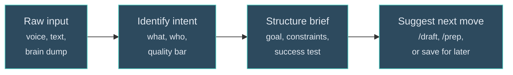

# /prompt - Structure Messy Thinking

| | |
|---|---|
| **Runtime** | ~30 seconds |
| **Reads** | Raw input (pasted text, file, or dictated thoughts) |
| **Writes** | Structured brief (optionally saved to inbox) |
| **Model** | Claude Code |

## What It Does

Takes unstructured input - dictated thoughts, rambling voice notes, stream-of-consciousness text - and structures it into a clean, actionable brief. The brief becomes the input to whatever skill or session comes next.

## Why It Matters

The gap between "I know what I want" and "Claude knows what I want" is where most AI interactions waste time. You dictate something while walking, paste it into Claude, and then spend 5 minutes answering clarifying questions before anything useful happens.

`/prompt` closes that gap. It reads the mess, infers the intent, structures the ask, and suggests what to run next. One step between raw thinking and execution.

## How It Works



### Input

Three modes:

- **`/prompt [pasted text]`** - Structure whatever you paste
- **`/prompt path/to/file.md`** - Structure a transcript or text dump
- **`/prompt`** (no args) - Asks what's on your mind

### The Brief

The output follows a consistent format:

```markdown
## Brief

**Goal:** One sentence. What needs to exist when this is done.

**Context:** What you know that Claude needs to know.

**Audience:** Who will read/use the output. (Skipped if it's just for you.)

**Constraints:**
- Hard requirements from your input
- Inferred: Implicit constraints flagged explicitly

**Output:** Format, length, tone.

**Success looks like:** The "done" test in one sentence.
```

### The Next Move

After structuring, `/prompt` suggests what to do with the brief:

- Writing task -> `/draft` or `/prep`
- Strategic analysis -> Start a session with the brief
- Vault task -> Routes to `/transform`, `/weekly`, `/inbox`
- Thinking exercise -> Work through it now or save for later

It never auto-executes. The brief is the deliverable. You decide what runs next.

## Edge Cases

The skill handles several common patterns:

- **Already structured input** - "This is already clean. Want me to tighten it or just run it?"
- **Simple task disguised as a brief** - Routes to task capture instead of over-structuring
- **Long brain dumps (>2000 words)** - Identifies threads first, then asks which to structure
- **Multiple distinct asks** - Splits into numbered briefs
- **Venting mixed with action** - Extracts the action, acknowledges the energy, skips the therapy

## Example

**Input:** "I need to write something for the investment partner about how the project went, what we proved, what the methodology looks like, maybe position it as the playbook for other portfolio companies"

**Output:**

```markdown
## Brief

**Goal:** Strategic memo positioning a completed project as
proof-of-concept for a replicable transformation methodology.

**Audience:** Investment partner - lead with quantified outcomes,
methodology second.

**Constraints:**
- Must include specific metrics (margin impact, timeline, costs)
- Position as portfolio-replicable, not one-off
- Inferred: Confident but not overclaiming

**Output:** 2-3 page strategic memo. Economics-first framing.

**Success looks like:** Partner asks "which portfolio company
is next?" not "prove it works."

-> Run /prep [project] [stakeholder] with this brief as input.
```

30 seconds from ramble to executable brief.

## Where It Fits

`/prompt` sits upstream of everything else. It's the funnel that turns raw thinking into structured input for the rest of the system:

```
/prompt -> /prep -> /draft -> /challenge -> ship
/prompt -> strategic session -> decisions -> /transform
/prompt -> save brief -> pick up later
```

## Related

- [/draft](draft.md) - Downstream: writes the content the brief describes
- [/prep](../architecture/skills-system.md) - Downstream: explores vault context before writing
- [/transform](transform.md) - Alternative: for structured transcripts, not raw thinking
- [Skills System](../architecture/skills-system.md) - How skills connect and compose
