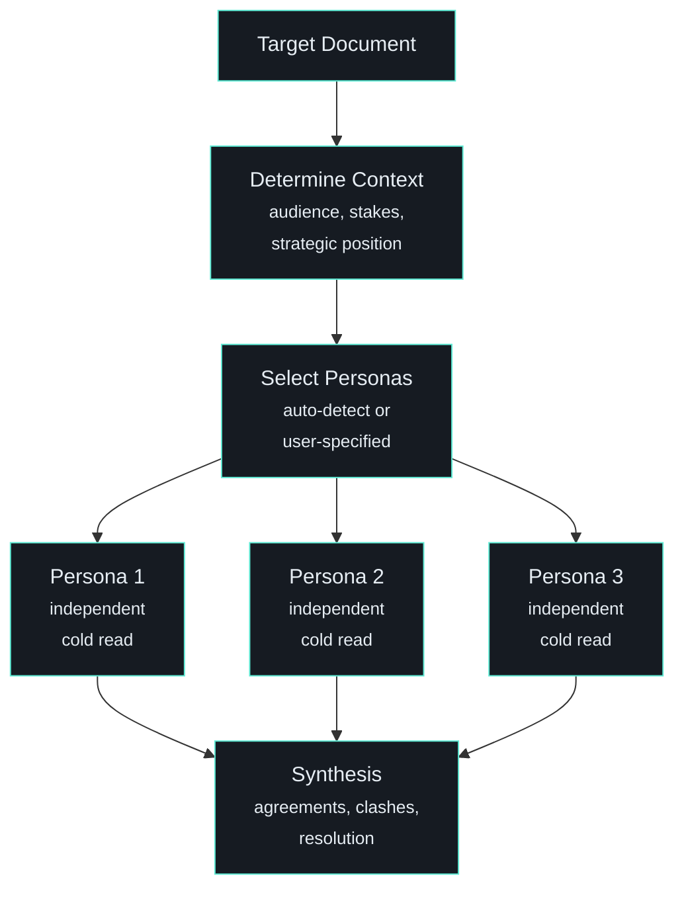

# /stress-test - Multi-Persona Adversarial Debate

| | |
|---|---|
| **Runtime** | ~10-15 minutes |
| **Reads** | Target document, theme context, stakeholder profiles |
| **Writes** | Debate synthesis to stdout |
| **Model** | Opus (3 parallel subagents + synthesis) |

## What It Does

Three personas independently evaluate a document, then the synthesis focuses on where they **disagree**. The clashes surface hidden assumptions that no single reviewer catches.

## How It's Different from /challenge

| `/challenge` | `/stress-test` |
|---|---|
| 5 structured critique lenses | 3 distinct people with different priors |
| Checklist-style analysis | Perspective diversity |
| Catches known blind spots | Discovers unknown ones |
| Quick pre-send QA (~5 min) | Important documents, multiple stakeholders (~15 min) |
| You know what might be wrong | You don't know what you don't know |

Both are valid. Run `/challenge` first for the quick structural check, then `/stress-test` on anything going to a board or investment committee.

## How It Works



### Input

Four modes:

- **`/stress-test path/to/file.md`** - Auto-detect personas from content
- **`/stress-test file.md "Sceptical IC Member, Portfolio CEO, Operating Partner"`** - Specify personas
- **`/stress-test`** (no args) - Stress-test whatever you've been working on
- **`/stress-test debate`** - Extended mode: personas respond to each other's critiques

### Persona Selection

If you don't specify personas, the system auto-detects based on content:

| Content Type | Persona Set |
|---|---|
| Board memo, IC paper | Sceptical committee member, Portfolio CEO who's seen this pitch, Operations-focused partner |
| Email to senior stakeholder | The recipient (modelled on their concerns), A competing thesis advocate, Someone burned by similar claims |
| Client proposal | The budget holder, The internal champion selling it up, The incumbent vendor's defender |
| Strategic plan | Day-1 employee reading this, The board member who funded it, The sceptic who voted against |
| Technical architecture | The CTO building it, The CFO funding it, The user living with it |
| LinkedIn post | A sharp-tongued peer, Someone who's never heard of you, A potential client |

Each persona gets a name, role, and stated prior/bias. At least one must be adversarial.

### The Synthesis (Where the Value Lives)

The individual assessments matter less than the synthesis. The output focuses on:

**Where they agree** - issues all three flagged. These are definite problems.

**Where they clash** - the main section, 2-3x longer than agreements. Each clash includes:

- What each persona thinks and why
- What the disagreement reveals (the hidden assumption or trade-off)
- How to resolve it

**Three questions** - one from each persona that the document doesn't answer.

### Extended Debate Mode

With the `debate` flag, personas see each other's assessments and respond. This second round reveals:

- Which positions shifted (genuine persuasion happened)
- Which positions hardened (these are the real fault lines)
- New issues that emerge from the cross-pollination

Takes longer but surfaces deeper assumptions.

## Design Principles

- **Fresh agents are non-negotiable.** The value comes from cold evaluation without session context bias. Never simulate personas in the main conversation
- **Clashes over agreements.** Agreements confirm known issues. Disagreements reveal unknown ones
- **Don't manufacture disagreement.** If all three agree, say so. Forced debate is worse than genuine consensus
- **Match stakes to effort.** A quick email gets terse assessments. A board paper gets the full treatment with debate mode

## Where It Fits

`/stress-test` sits alongside `/challenge` in the quality assurance pipeline:

```
/draft -> /challenge (quick structural check) -> /stress-test (perspective diversity) -> ship
```

## Related

- [/challenge](challenge.md) - Complementary: structured critique lenses vs persona diversity
- [/draft](draft.md) - Upstream: creates the content that gets stress-tested
- [/capture](capture.md) - If the stress-test surfaces a good framing, capture it
- [Skills System](../architecture/skills-system.md) - How skills compose with each other
