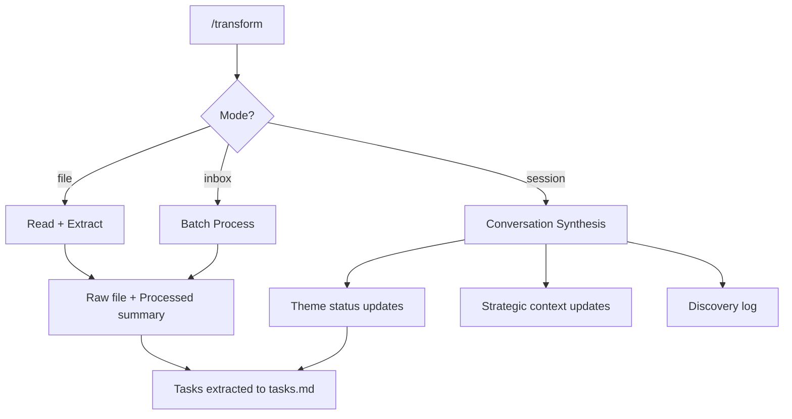

# /transform - Content Processing

## What It Does

Converts external content into structured vault entries. Handles three modes: single file processing, batch inbox clearing, and synthesising the current conversation itself into vault updates.

## Why It Matters

Information arrives in messy formats - meeting transcripts, email threads, AI conversation exports, raw notes. If it stays messy, it never gets found again. If you process it manually, you spend more time filing than thinking.

`/transform` handles the filing. You provide the content and the theme. It extracts decisions, action items, insights, and open questions, then routes everything to the right place.

## How It Works



### Single File Mode (`/transform [file]`)

1. Reads the input file
2. For transcripts: asks if a speaker-labelled version exists
3. Extracts summary (3-5 sentences), decisions, action items, key insights
4. Asks which theme it belongs to
5. Creates **two files** - the raw transcript and a processed summary that links back to it
6. Adds extracted actions to `tasks.md`
7. Moves the original to `99_System/logs/processed/`

### Batch Mode (`/transform inbox`)

Processes everything in `00_Inbox/`. Same extraction logic as single file mode, but handles multiple files in sequence, collecting theme assignments upfront before writing.

### Session Synthesis Mode (`/transform session`)

This is the unique one. Instead of processing an external file, it processes the **conversation itself**.

1. Reviews the current chat for new strategic insights, framework IP, stakeholder updates, status changes, and cross-domain effects
2. Proposes specific updates to theme files (`status.md`, `strategic-context.md`, `people.md`)
3. Shows proposed changes before writing
4. Creates a discovery log at `99_System/logs/conversation-discoveries/`
5. Logs improvement suggestions (friction points from the session)

## The Key Innovation

**Session synthesis turns conversations into institutional memory.** Most AI chat sessions produce good thinking that evaporates when the window closes. `/transform session` captures what changed during the conversation and writes it into the vault's permanent structure.

It also runs a **performance vs prep** comparison. If a prep doc exists for a meeting whose transcript you're processing, it automatically scores what landed, what was missed, and what was improvised. This closes the feedback loop between preparation and execution.

The improvement suggestions engine runs on every session synthesis. Friction points get logged with occurrence counts. When the same issue hits 3+ times, it becomes a BEAD - a candidate for permanent system improvement. The system literally gets better at helping you by tracking where it falls short.

**Capture vs synthesis** - the skill always asks upfront whether you want a capture (factual record of what happened) or a synthesis (recommendations for what should happen next). "Summary" does not default to "proposal".

## Example Usage

Process a single transcript:

```
/transform 00_Inbox/transcripts/2026-02-25_client-call.md
```

Clear the inbox:

```
/transform inbox
```

Synthesise the current conversation:

```
/transform session
```

## Customisation Guide

- **Theme list** - Edit the SKILL.md to include your active themes so the skill can suggest routing
- **Two-file rule** - Every transcript produces a raw file and a processed summary. The summary always links to the raw. This is non-negotiable in the default config, but you can disable it for non-transcript content.
- **Discovery log threshold** - Defaults to creating logs for conversations of 50+ messages or substantial ground covered. Adjust based on your session length patterns.
- **Improvement suggestions** - The friction-tracking engine runs automatically. Review accumulated suggestions during `/weekly`.
