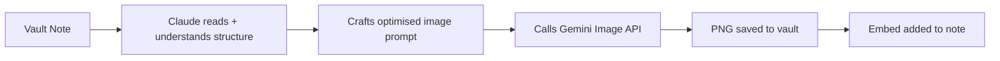

# /visualise - AI Image Generation

| | |
|---|---|
| **Runtime** | ~10 seconds per image |
| **Reads** | Source note from vault |
| **Writes** | PNG image to vault, embed link in source note |
| **Model** | Google Nano Banana Pro (Gemini Image API) |

## What It Does

Reads any vault note and generates a professional infographic, diagram, or knowledge card from it. Claude crafts an optimised prompt, calls Google's image generation API, saves the PNG alongside the note, and embeds it in the markdown.

## Why It Matters

Markdown is great for thinking. It's terrible for communicating complex frameworks at a glance. A three-tier model described in bullet points takes 30 seconds to parse. The same model as a visual diagram takes 3 seconds.

The bottleneck was never the image generation - it was the prompting. Writing a good prompt for an image model requires translating abstract concepts into spatial relationships, colour coding, text placement, and visual hierarchy. That translation is exactly what an AI assistant with full vault context does well.

`/visualise` makes Claude the prompt engineer. You point at a note, it reads the full context, crafts a detailed prompt optimised for Nano Banana Pro's strengths (accurate text rendering, logical layouts), generates the image, and puts it where it belongs.

## How It Works



1. **Read the source** - Claude reads the full note to understand the concept, relationships, hierarchy, and key terms
2. **Craft the prompt** - Translates the content into a detailed image generation prompt with explicit spatial layout, text labels, colour guidance, and style
3. **Generate** - Calls the Gemini Image API via a local wrapper script
4. **Save and embed** - Writes the PNG to the same directory and adds an Obsidian embed link

## The Key Innovation

**Claude as prompt engineer, not the user.** The gap between "I want a diagram of this framework" and the prompt that actually produces a good diagram is significant. You'd need to specify:

- Visual type (layered diagram, flow chart, matrix, timeline)
- Spatial layout (vertical stack, left-to-right, 2x2 grid)
- Every text label that must appear (Nano Banana Pro renders text accurately, but needs it spelled out)
- Colour coding and visual hierarchy
- Style and typography

Claude already understands the note's structure. It knows which elements are tiers, which are comparisons, which are sequential steps. That structural understanding translates directly into prompt engineering that a human would spend 5 minutes crafting manually.

## Two Quality Tiers

| Tier | Model | Cost | Best For |
|------|-------|------|----------|
| **Flash** | Gemini 2.5 Flash Image | ~$0.04/image | Internal vault visuals, quick iteration |
| **Pro** | Nano Banana Pro (Gemini 3 Pro Image) | ~$0.13/image | External content, LinkedIn, presentations |

Pro produces noticeably better text rendering, layout precision, and visual polish. Use it for anything leaving the vault.

## Example Usage

Visualise a specific note:

```
/visualise 02_Themes/frameworks/autonomy-model.md
```

Visualise by concept name (Claude searches the vault):

```
/visualise the three-tier work architecture
```

Specify quality tier:

```
/visualise that framework diagram, use pro quality
```

## What It Generates

The skill handles different visual types based on the source content:

| Source Content | Visual Output |
|---------------|--------------|
| Framework with tiers/levels | Layered diagram with progression arrows |
| Process or workflow | Flow diagram with sequential steps |
| A vs B comparison | Side-by-side chart with matching rows |
| Hierarchy or org structure | Tree diagram with nesting |
| Timeline or roadmap | Horizontal timeline with milestones |
| Concept or definition | Knowledge card with key attributes |
| Multi-factor model | Matrix or grid layout |

## Image Editing

Already have a generated image that needs tweaking? Pass `--input-image` to modify an existing PNG:

```
"Make the background darker and increase the font size" --input-image existing-diagram.png
```

This uses Nano Banana Pro's image-to-image editing - faster and more consistent than regenerating from scratch.

## Setup

1. Get a Google AI Studio API key at [aistudio.google.com/apikey](https://aistudio.google.com/apikey)
2. Add to your shell profile: `export GOOGLE_API_KEY="your-key-here"`
3. Install the Python SDK: `pip install google-genai`
4. Copy the `~/bin/visualise` wrapper script from the template

The free tier is generous for personal use. Billing-enabled keys unlock the Pro model and higher rate limits.

## Customisation Guide

- **Default model** - Edit the script to change from `flash` to `pro` if you always want top quality
- **Aspect ratios** - The skill defaults to 16:9. Override with `--aspect 1:1` for social media or `--aspect 9:16` for tall diagrams
- **Style preferences** - Add your preferred style to the SKILL.md prompt template (dark mode, specific colour palette, etc.)
- **Output location** - The skill saves images alongside source notes by default. Modify the path convention in SKILL.md if you prefer a central `assets/` folder
