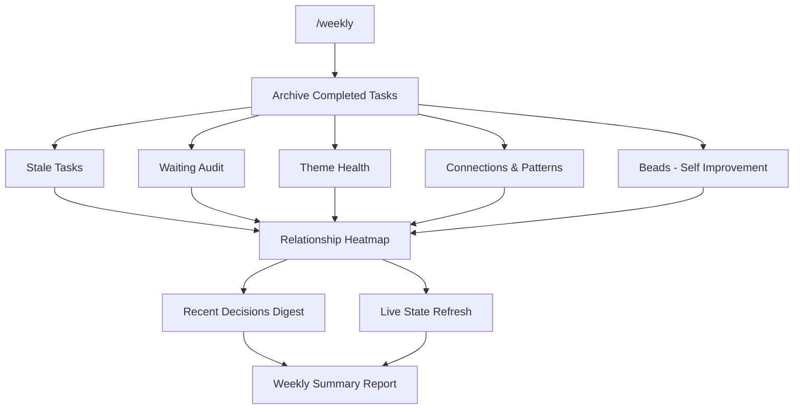

# /weekly - System Maintenance

| | |
|---|---|
| **Runtime** | ~30 minutes |
| **Reads** | `tasks.md`, all theme files, memory files, `improvement-suggestions.md` |
| **Writes** | `tasks.md`, archive, `recent-decisions.md`, `stakeholder-live.md`, MEMORY.md |
| **Model** | Opus (7 parallel subagents) |

## What It Does

Runs a full system audit: archives completed tasks, surfaces stale items, audits waiting lists, checks theme health, refreshes memory digests, and generates a weekly summary report. Takes about 30 minutes. The crown jewel of the QM system.

## Why It Matters

Knowledge systems decay. Tasks go stale. Waiting items slip through cracks. Connections between themes form but nobody records them. Memory files drift out of date.

Without weekly maintenance, your vault becomes a write-only medium. `/weekly` is the garbage collection pass that keeps the system honest.

## How It Works



The workflow runs in stages, with parallel subagents where dependencies allow:

**Stage 1 - Archive** (sequential, modifies `tasks.md`):
Move all completed tasks to `01_Todos/archive/YYYY-MM.md`, grouped by theme and month.

**Stage 2 - Seven parallel subagents:**

| Subagent | What It Does |
|----------|-------------|
| **A - Stale Tasks** | Finds tasks with no due date and no recent activity. Suggests: archive, someday list, or keep. |
| **B - Waiting Audit** | Calculates ages of all @waiting() items. Flags >14 days for escalation. Groups by urgency. |
| **C - Theme Health** | Counts open tasks per theme. Flags overload (>15 tasks) or inactivity (0 tasks). |
| **D - Connections** | Verifies active cross-theme connections still hold. Proposes new ones from recent meeting patterns. Removes stale entries (>42 days unverified). |
| **E - Beads** | Reads `improvement-suggestions.md`. Surfaces items with 3+ occurrences as ready to implement. Flags stale suggestions for cleanup. |
| **F - Decisions Digest** | Reads conversation discovery logs from the past 2 weeks. Extracts key decisions. Writes `recent-decisions.md`. |
| **G - Live State** | Refreshes `stakeholder-live.md` and MEMORY.md's Live Strategic State from current theme status files. |

**Stage 3 - Relationship heatmap** (sequential, runs script):
Refreshes the stakeholder relationship tracker and flags overdue contacts.

**Stage 4 - Summary report** consolidates everything into a single output.

## The Key Innovation

**Parallel subagent architecture.** Seven independent maintenance tasks run simultaneously, each as a Task worker. This turns a 30-minute sequential audit into something that completes in the time of the slowest subagent.

The real value is in Subagent D (Connections). It doesn't just check existing connections - it scans recent meetings across all themes looking for patterns that bridge domains. A name appearing in two unrelated themes. A decision in one project that affects another. These get proposed as new connections for your review.

The Beads system (Subagent E) closes the self-improvement loop. Every `/transform session` logs friction points. When the same friction appears three times, `/weekly` surfaces it as a BEAD - ready to become a permanent system improvement.

## Example Usage

```
/weekly
```

Also supports a random exploration mode:

```
/weekly random
```

This surfaces a random vault note for review. Useful for rediscovering forgotten context and making new connections.

## Customisation Guide

- **Thresholds** - Stale items: 14 days default. Theme overload: 15 tasks. Waiting escalation: 14 days. Adjust in SKILL.md.
- **Stakeholders for live refresh** - Edit Subagent G to list your key stakeholders by name. Only listed people get their profiles refreshed.
- **Connection verification window** - Defaults to 21 days before marking stale, 42 before removal. Tighten for fast-moving environments.
- **Reflection prompts** - The summary ends with four reflection questions. Replace these with whatever prompts you to think honestly about the week.
- **Schedule** - Designed for Sunday evening or Monday morning. Run whenever works for your rhythm.
